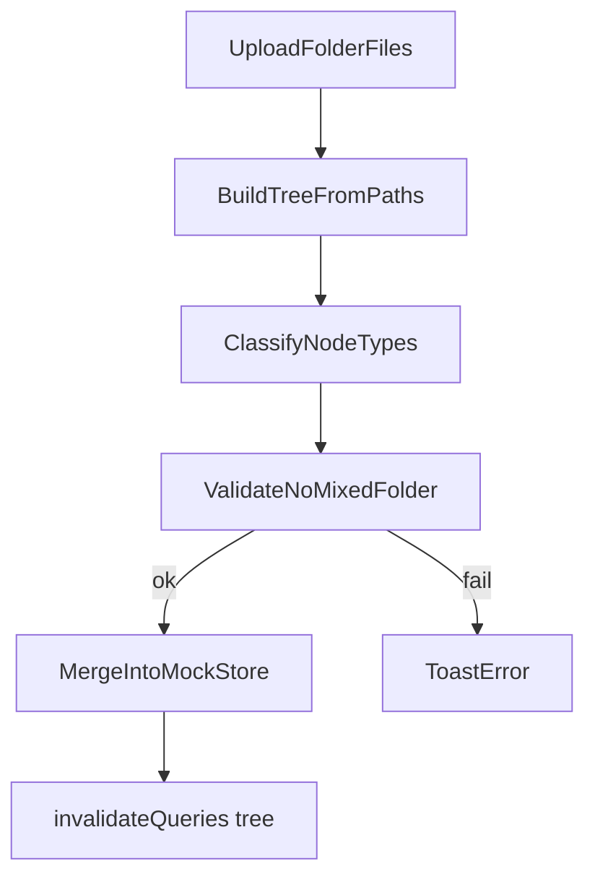
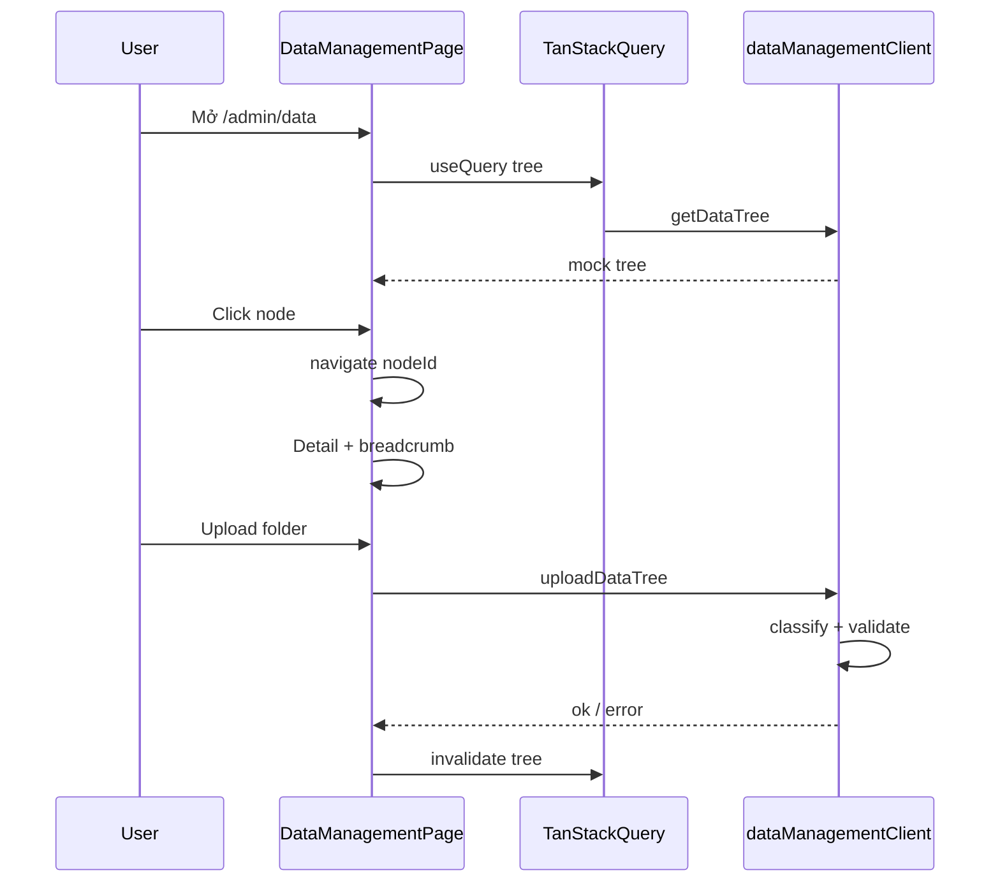

# Trang Quản lý dữ liệu (Admin)

## Phạm vi

Trang front-end **Quản lý dữ liệu** là child route của `/admin`, cùng pattern với [users](src/app/routes/admin/users/index.tsx). Backend chưa có — dùng mock + `queryOptions`/`apiClient` stub để swap API sau này mà không đổi UI.

## Cây thư mục — mô hình & quy tắc

Ba loại node (`DataNodeType`):

| Loại | Key | Định nghĩa |
|------|-----|------------|
| Tài liệu | `document` | File `.pdf` |
| Hồ sơ | `record` | Thư mục **có chứa** PDF (trực tiếp hoặc trong cây con) |
| Thư mục rỗng | `empty_folder` | Thư mục **không** chứa PDF ở bất kỳ đâu trong nhánh |

**Ràng buộc upload (validate client):** Một thư mục không được vừa có **file PDF trực tiếp** vừa có **thư mục con được phân loại `record`**. Ví dụ lỗi:

```
Parent/
  file.pdf          ← document
  SubHoSo/
    other.pdf       ← SubHoSo là record → INVALID
```

Thuật toán (trong `lib/treeClassifier.ts` + `lib/treeValidator.ts`):

1. Parse `File[]` từ input `webkitdirectory` → cây theo `webkitRelativePath`
2. Bottom-up: folder có PDF trong nhánh → `record`; không → `empty_folder`
3. Per-folder: nếu có PDF trực tiếp **và** có child `record` → reject + message i18n
4. Chỉ chấp nhận `.pdf` (các file khác: reject hoặc bỏ qua + toast cảnh báo — mặc định reject để rõ ràng)



## Layout UI

```
┌─────────────────────────────────────────────────────────────┐
│ [Search........................]  [Upload cây thư mục]        │
│ Root > Hồ sơ A > Tài liệu.pdf    (breadcrumb in-page)       │
├──────────────────┬──────────────────────────────────────────┤
│ Folder tree      │ Detail panel                             │
│ (icons + badge)  │ type, size, uploadedAt, uploadedBy       │
│                  │ + PdfViewer nếu document                 │
└──────────────────┴──────────────────────────────────────────┘
```

- **Chiều cao:** `flex min-h-0` + `calc(100vh - offset)` / `-m-6` trong admin main (tương tự [ui-patterns detail page](.cursor/rules/ui-patterns.mdc)) để tránh double scroll
- **Split:** [`ResizablePanelGroup`](src/components/ui/resizable.tsx) — trái ~30%, phải ~70%
- **Tree:** expand/collapse, icon theo type (`FileText`, `FolderOpen`, `Folder`), badge màu semantic (utility OK cho data type)
- **Detail:** [`PdfViewer`](src/components/common/PdfViewer.tsx) + `useInlinePdfUrl`; mock PDF dùng URL public (vd. sample từ `/public` hoặc CDN) hoặc `URL.createObjectURL` cho file vừa upload
- **Upload dialog:** [`Dropzone`](src/components/ui/dropzone.tsx) + hidden `<input type="file" webkitdirectory multiple />` (Dropzone không hỗ trợ directory native — dùng input riêng trong dialog)

**Breadcrumb in-page** (không dùng `AppBreadcrumb` — admin layout không có `DashboardHeader`): build từ `nodeId` → path ancestors; click segment → `navigate({ search: (prev) => ({ ...prev, nodeId }) })`.

## URL state (TanStack Router)

Route search params (sync filter/selection):

```ts
// schemas.ts
z.object({
  q: z.string().optional(),
  nodeId: z.string().optional(),
})
```

- `q`: search client-side trên tên node (flatten tree + filter, highlight trong tree)
- `nodeId`: node đang chọn → detail panel + breadcrumb
- Upload/selection: `navigate({ to: '.', search: (prev) => ({ ...prev, nodeId: id }) })` — giữ `q`

## Cấu trúc file

```
src/
├── app/routes/admin/
│   ├── route.tsx                          (modified) — sidebar link mới
│   └── data/
│       └── index.tsx                      (new) — thin route controller
├── features/data-management/
│   ├── api/
│   │   └── dataManagementClient.ts      (new) — mock + TODO API paths
│   ├── components/
│   │   ├── DataManagementPage.tsx       (new) — layout orchestrator
│   │   ├── DataManagementToolbar.tsx    (new) — search + upload
│   │   ├── DataTreeBreadcrumb.tsx       (new)
│   │   ├── DataFolderTree.tsx           (new)
│   │   ├── DataNodeDetailPanel.tsx      (new)
│   │   ├── DataNodeTypeBadge.tsx        (new)
│   │   └── FolderUploadDialog.tsx       (new)
│   ├── lib/
│   │   ├── mockData.ts                  (new) — seed tree mẫu
│   │   ├── treeClassifier.ts            (new)
│   │   ├── treeValidator.ts             (new)
│   │   └── uploadParser.ts              (new) — webkitRelativePath → nodes
│   ├── queries.ts                       (new)
│   ├── schemas.ts                       (new)
│   └── types.d.ts                       (new)
└── lib/i18n/locales/
    ├── en/data-management.json          (new)
    └── vi/data-management.json          (new)
```

Đăng ký namespace trong [config.ts](src/lib/i18n/config.ts) và [i18next.d.ts](src/types/i18next.d.ts).

## Route & sidebar

**Route** [`src/app/routes/admin/data/index.tsx`](src/app/routes/admin/data/index.tsx):

- `beforeLoad`: kế thừa auth từ parent `/admin`
- `validateSearch`: `dataManagementSearchSchema`
- `loader`: `ensureQueryData(dataManagementTreeQueryOptions())`
- `head`: title từ `data-management.pageTitles.main`
- `errorComponent`: pattern giống users (reset + `translateError`)
- `component`: render `<DataManagementPage />`

**Sidebar** [route.tsx](src/app/routes/admin/route.tsx):

- Thêm `AdminNavLink to="/admin/data"` icon `Database` hoặc `FolderTree`
- Mở rộng union type `to`: `'/admin/users' | '/admin/groups' | '/admin/data'`
- i18n `common.admin.dataManagement`: EN "Data management", VI "Quản lý dữ liệu"

## Mock & chuẩn bị API

**types.d.ts** — entity đọc:

```ts
export type DataNodeType = 'document' | 'record' | 'empty_folder'

export interface DataTreeNodeT {
  id: string
  name: string
  type: DataNodeType
  parentId: string | null
  children: DataTreeNodeT[]
  sizeBytes: number
  uploadedAt: string      // ISO
  uploadedBy: string
  mimeType?: string
  fileUrl?: string        // PDF preview URL
}
```

**dataManagementClient.ts** (mock-first):

| Hàm | Mock hiện tại | API tương lai (stub comment) |
|-----|---------------|------------------------------|
| `getDataTree()` | Trả `mockData` + in-memory mutations | `GET /api/v1/admin/data/tree` |
| `uploadDataTree(payload)` | Validate + merge in-memory + delay | `POST /api/v1/admin/data/upload` multipart |

- In-memory store module-level trong client (hoặc `sessionStorage` nếu cần persist refresh) — đủ demo
- `queries.ts`: `dataManagementTreeQueryKey`, `dataManagementTreeQueryOptions`, `useUploadDataTreeMutation` invalidate tree key

**Mock seed** (`mockData.ts`): 1 root, 2 hồ sơ (mỗi cái vài PDF), 1 thư mục rỗng, metadata giả (`uploadedBy: "Admin Demo"`).

## Component chi tiết

| Component | Trách nhiệm |
|-----------|-------------|
| `DataManagementToolbar` | `Input` search debounced → URL `q`; nút mở `FolderUploadDialog` |
| `DataTreeBreadcrumb` | Path từ `nodeId`; click → navigate |
| `DataFolderTree` | Recursive tree; filter theo `q`; click set `nodeId` |
| `DataNodeDetailPanel` | Empty state khi chưa chọn; Card metadata; `PdfViewer` khi `type === 'document'` |
| `DataNodeTypeBadge` | Label i18n `nodeType.document` / `record` / `empty_folder` |
| `FolderUploadDialog` | Chọn folder → parse → validate → `uploadDataTree` mutation → toast success/error |

**PdfViewer:** bọc trong `DataPdfPreview.tsx` (thin) — truyền `fileUrl`; có thể dùng `defaultValue` cho text hoặc thêm keys `preview.*` vào namespace `data-management` (tránh phụ thuộc `question-studio`).

## i18n (namespace `data-management`)

Keys tối thiểu:

- `title`, `pageTitles.main`
- `search.placeholder`, `actions.uploadFolder`
- `nodeType.document` | `record` | `empty_folder`
- `detail.*` (type, size, uploadedAt, uploadedBy, emptySelection)
- `breadcrumb.root`
- `upload.title`, `upload.success`, `upload.errors.mixedFolder`, `upload.errors.invalidFile`
- `errors.loadFailed`

## Luồng tương tác



## Ghi chú triển khai

- Không tạo `common/` abstraction cho tree — logic nằm trong feature (Rule of Three)
- Khi backend sẵn sàng: chỉ sửa `dataManagementClient.ts` + payload types; giữ `queries.ts` và components
- Groups route vẫn TODO — không đụng trong scope này

## Kiểm tra thủ công (sau implement)

1. Sidebar hiện "Quản lý dữ liệu" → `/admin/data`
2. Mock tree hiển thị đúng 3 loại icon/badge
3. Click PDF → metadata + preview; click folder → metadata không preview
4. Search lọc tên trên tree; breadcrumb điều hướng đúng
5. Upload folder hợp lệ → cây cập nhật; upload folder mixed PDF + sub-record → toast lỗi
6. Refresh URL với `?nodeId=...&q=...` giữ state
