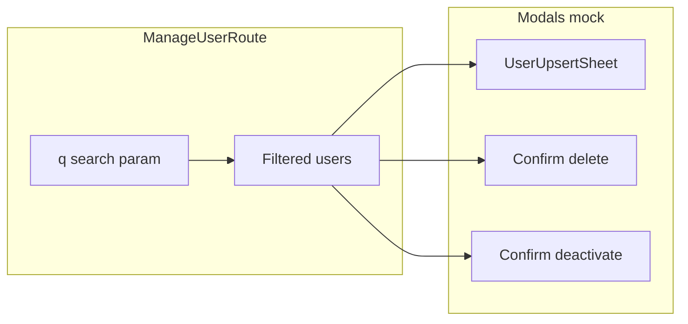

# Kế hoạch: Admin /users — modal mock, tìm kiếm, vai trò, layout

## Cây file dự kiến

```
src/
├── components/common/
│   └── EntitySheet.tsx (modified)
├── features/user/
│   ├── schemas.ts (modified hoặc new — schema form mock)
│   ├── components/
│   │   ├── ManageUser.tsx (modified)
│   │   ├── UserUpsertSheet.tsx (new)
│   │   └── UserConfirmDialog.tsx (new, tùy chọn gộp 1 file)
├── app/routes/admin/
│   ├── route.tsx (modified)
│   └── users/index.tsx (modified)
├── lib/i18n/locales/
│   ├── en/user.json (modified)
│   └── vi/user.json (modified)
└── types/
    └── i18next.d.ts (modified — thêm namespace `user` cho type-safe `t()`)
```

## 1. Sheet tạo/sửa (mock, tái sử dụng)

- Dùng [`EntitySheet`](src/components/common/EntitySheet.tsx) (slide từ **phải**, đúng UX “panel bên phải”). Radix đã portal — khớp quy tắc dự án.
- **Generic `id`**: Hiện `EntitySheet` yêu cầu `entity extends { id: string }` trong khi [`UserT`](src/features/user/types.ts) có `id: number`. Sửa constraint thành `id: string | number` (và hiển thị `String(entity.id)` nếu cần) để không phải wrapper giả.
- Component mới `UserUpsertSheet`: props `open`, `onOpenChange`, `user: UserT | null` (`null` = thêm mới). Truyền `createTitleKey="pageTitles.create"`, `editTitleKey="pageTitles.edit"`, `namespace="user"`, `maxWidth="lg"` hoặc `"xl"` nếu form rộng hơn.
- Form con (ví dụ `UserUpsertForm`): theo [`data-and-forms.mdc`](.cursor/rules/data-and-forms.mdc) dùng **`useAppForm` + `FormField`** từ `@/lib/forms`, schema Zod nhỏ trong [`features/user/schemas.ts`](src/features/user/schemas.ts) (ví dụ `firstName`, `lastName`, `email` — khớp bảng hiện tại). `defaultValues` từ `user` khi sửa, `{}` khi tạo.
- **`key={user?.id ?? 'new'}`** trên form (bắt buộc theo CRUD guide) để đổi user/edit↔create không kẹt state.
- Footer trong body sheet: `flex flex-col min-h-[...]` hoặc `mt-auto` + `border-t` + **`justify-end gap-2`** — nút **Đóng** (secondary) + nút primary: **`user ? t('actions.save') : t('actions.add')`** (đổi key i18n nếu cần tách rõ “Thêm mới” vs “Lưu”; hiện [`user.json`](src/lib/i18n/locales/en/user.json) có `actions.add` / `actions.save`).
- `onSubmit`: chỉ `toast.success` (sonner) hoặc `console.log` + `onOpenChange(false)` — **không** mutation/API.

## 2. Xóa và khóa / deactivate (mock, “tương tự xóa”)

- Một component xác nhận tái sử dụng (props `variant: 'delete' | 'deactivate'`, `user`, `open`, `onOpenChange`, `onConfirm`) dựa trên [`AlertDialog`](src/components/ui/alert-dialog.tsx): title/description/button theo `user` namespace.
- `onConfirm`: mock (toast + đóng dialog), không API.

## 3. Nút Import Excel

- Trên [`admin/users/index.tsx`](src/app/routes/admin/users/index.tsx), cạnh nút thêm mới: `Button` `variant="outline"` + icon `FileSpreadsheet` (lucide). Ẩn `<input type="file" accept=".xlsx,.xls" />`, `onChange` mock toast “Đã chọn file (mock)” — không upload.

## 4. Mở rộng bảng + cột vai trò (mock)

- [`admin/route.tsx`](src/app/routes/admin/route.tsx): layout `flex h-full min-h-0`, aside cố định width, **`<main className="flex-1 min-w-0 overflow-y-auto p-4">`** — `min-w-0` quan trọng để bảng không bị co về trái trong flex.
- [`ManageUser.tsx`](src/features/user/components/ManageUser.tsx): bọc ngoài `w-full min-w-0`; bảng `w-full`; thêm `<th>` / `<td>` **Vai trò** — giá trị từ helper `getMockRole(userId: number)` (mảng cố định 3–4 vai trò + `user.id % length`), không đụng API.

## 5. Thanh tìm kiếm (dưới title)

- Route [`admin/users/index.tsx`](src/app/routes/admin/users/index.tsx): thêm **`validateSearch`** với Zod, ví dụ `q: z.string().optional()` (hoặc `.catch('')`).
- `Input` + icon `Search`: dùng `useNavigate` + `search: (prev) => ({ ...prev, q: value || undefined })` (giữ param khác nếu sau này có thêm) — khớp [routing.mdc](.cursor/rules/routing.mdc).
- Lọc danh sách **client-side** theo `q` (tên + email) trước khi truyền vào `UserTable` (mock; sau này có thể chuyển sang API + `appendListParams`).

## 6. AdminLayout có style

- Thay inline style bằng Tailwind + token semantic: `bg-background`, `bg-card`, `border-border`, `text-foreground`, `text-muted-foreground`.
- Nav: [`Link`](https://tanstack.com/router/latest/docs/framework/react/api/router/linkComponent) với `activeProps` / `inactiveProps` (className `bg-accent` khi active), typography nhất quán; chuỗi menu chuyển sang **`useTranslation('user')`** với key mới ví dụ `admin.nav.users`, `admin.nav.groups` (thêm vào `en/vi user.json`).

## 7. Icon khóa / deactivate cạnh Sửa, Xóa

- Thêm `Button` ghost + `UserRoundX` hoặc `Ban` / `Lock` (lucide) + `title`/`aria-label` từ i18n; `onClick` mở confirm deactivate (mock).

## 8. Dọn code hiện có

- [`ManageUser.tsx`](src/features/user/components/ManageUser.tsx): bỏ `navigate({ to: '/users/...' as any })`; thay bằng callback props từ route (`onEdit`, `onDelete`, `onDeactivate`, …).
- [`admin/users/index.tsx`](src/app/routes/admin/users/index.tsx): chuyển text sang namespace **`user`** (đã có [`list.title`](src/lib/i18n/locales/en/user.json), v.v.) thay cho `useTranslation('common')` + fallback string; nút “Thêm mới” bỏ `bg-indigo-600` — dùng `Button` default (**`bg-primary`**) hoặc `variant="default"`.
- Icon sửa: có thể giữ `text-blue-600` theo ngoại lệ “data-specific” hoặc dùng `text-muted-foreground` — ưu tiên nhất quán token nếu không cần màu brand.

## 9. i18n & types

- Bổ sung keys vào [`en/user.json`](src/lib/i18n/locales/en/user.json) và [`vi/user.json`](src/lib/i18n/locales/vi/user.json): `search.placeholder`, `table.columns.role`, `actions.importExcel`, `actions.deactivate`, `delete.*`, `deactivate.*`, `form.actions.cancel`, `admin.nav.*`, và chỉnh `actions` nếu tách “Thêm mới” submit.
- Cập nhật [`i18next.d.ts`](src/types/i18next.d.ts) import `enUser` và thêm `user: typeof enUser` vào `resources` (config đã load `user` nhưng TS chưa biết).

## Sơ đồ luồng UI (tóm tắt)



## Ghi chú ngoài phạm vi (không làm trừ khi bạn yêu cầu)

- `errorComponent` cho route admin/users (rule “major routes”) — có thể thêm sau.
- `DataTableRowActions` yêu cầu `Row` từ TanStack Table; bảng hiện là HTML table — giữ row actions inline hoặc refactor sang DataTable sau.
