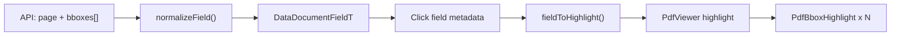

# Cập nhật bounding box: `bbox` → `bboxes`

## Folder tree (các file bị ảnh hưởng)

```
src/
├── features/
│   └── data-management/
│       ├── types.d.ts                              (modified)
│       ├── lib/
│       │   └── metadataHelpers.ts                  (modified)
│       └── components/
│           └── RecordDetailPanel.tsx               (modified)
└── components/
    └── common/
        └── PdfViewer.tsx                           (modified)
```

## Bối cảnh

Backend đã đổi contract mỗi field:

```json
"page": 1,
"bboxes": [[488.0, 1214.0, 2239.0, 1302.0]]
```

Frontend hiện chỉ đọc `bbox: number[]` → mọi field từ API mới có `bbox: []` → **highlight không bao giờ hiện**.

User xác nhận:
- Tọa độ **cùng hệ** với `page.getViewport({ scale: 1 })` → **không cần** thêm conversion layer
- **Chỉ** dùng `bboxes` mới, không backward-compat `bbox`

## Luồng sau khi sửa



## Chi tiết implementation

### 1. Type — [`src/features/data-management/types.d.ts`](src/features/data-management/types.d.ts)

Đổi `DataDocumentFieldT`:

```typescript
// Trước
bbox: Array<number>

// Sau
bboxes: Array<[number, number, number, number]>
```

Có thể thêm type alias `PdfBboxT` colocated hoặc export từ `PdfViewer` để tránh duplicate.

### 2. Parse metadata — [`src/features/data-management/lib/metadataHelpers.ts`](src/features/data-management/lib/metadataHelpers.ts)

**`normalizeField()`**: đọc `field.bboxes`, validate mỗi phần tử là mảng 4 số hợp lệ (`x2 > x1`, `y2 > y1`), map sang `number`.

**`createDraftCustomField()`**: `bboxes: []` thay `bbox: []`.

**`isDraftCustomField()`**: check `field.bboxes.length === 0` thay `field.bbox.length === 0`.

`mergeFormValuesIntoFields()` dùng spread `{ ...field, value }` — **không cần sửa**, `bboxes` được giữ khi save.

### 3. Highlight mapping — [`src/features/data-management/components/RecordDetailPanel.tsx`](src/features/data-management/components/RecordDetailPanel.tsx)

**`fieldToHighlight()`**:

```typescript
if (field.page < 1 || field.bboxes.length === 0) return null
return { page: field.page, bboxes: field.bboxes }
```

Filter box invalid (optional guard) trước khi return.

State `pdfHighlight` / `pendingFieldActivationRef` giữ nguyên flow — chỉ đổi shape của `PdfFieldHighlight`.

### 4. PdfViewer — [`src/components/common/PdfViewer.tsx`](src/components/common/PdfViewer.tsx)

**`PdfFieldHighlight` interface**:

```typescript
export interface PdfFieldHighlight {
  page: number
  bboxes: Array<[number, number, number, number]>
}
```

**Render**: thay single `<PdfBboxHighlight>` bằng map:

```tsx
{showHighlight
  ? highlight.bboxes.map((bbox, index) => (
      <PdfBboxHighlight key={index} bbox={bbox} metrics={metrics} />
    ))
  : null}
```

`PdfBboxHighlight` component giữ nguyên logic scale:

```typescript
scaleX = renderWidth / originalWidth
scaleY = renderHeight / originalHeight
left: x1 * scaleX, top: y1 * scaleY, ...
```

Auto-scroll tới `highlight.page` không đổi.

## Phạm vi ngoài plan

- [`DocumentMetadataForm.tsx`](src/features/data-management/components/DocumentMetadataForm.tsx): có `onFieldHighlight` nhưng chưa wire tới `PdfViewer` — **không sửa** trong scope này (chỉ `RecordDetailPanel` dùng highlight).
- Không thêm i18n (không có UI text mới).
- Không thêm automated tests (theo project rules).

## Manual test plan

1. Mở hồ sơ có metadata mẫu (vd. `HS1` / `CD_218_2023_001.pdf`)
2. Click field **"Cơ quan ban hành"** (`bboxes: [[487, 325, 902, 399]]`) → khung primary overlay khớp vùng text trên PDF trang 1
3. Click field **"Số bản án"** → overlay ở vùng khác (`y ≈ 1214`)
4. Resize panel PDF → box scale theo, không lệch
5. Field custom mới (draft) → không highlight ( `page: 0`, `bboxes: []` )
6. Save metadata → `bboxes` vẫn còn trong payload (verify qua network tab)

## Validation checklist

- Types: `bboxes` trên `DataDocumentFieldT`, không còn `bbox`
- Patterns: parse qua `normalizeField`, highlight qua `PdfViewer`
- Không hardcode UI strings mới
