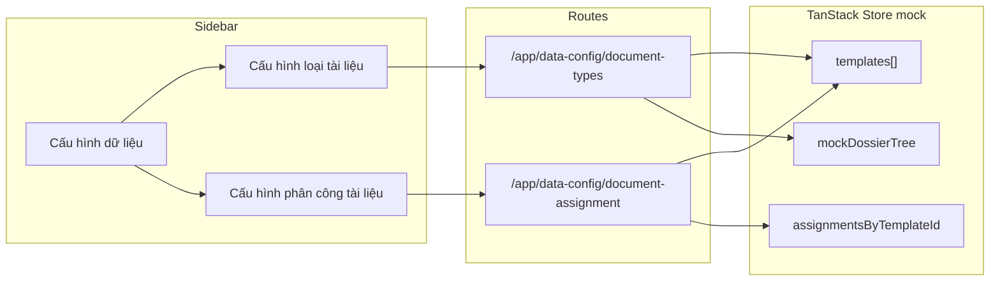

# Cấu hình dữ liệu — Mock Admin UI

## Folder tree (các file bị ảnh hưởng)

```
src/
├── app/routes/app/
│   └── data-config/
│       ├── index.tsx (new)                    # redirect → document-types
│       ├── document-types.tsx (new)
│       └── document-assignment.tsx (new)
├── features/
│   ├── data-config/
│   │   ├── components/
│   │   │   ├── DocumentTypeConfigPage.tsx (new)
│   │   │   ├── DocumentAssignmentConfigPage.tsx (new)
│   │   │   ├── DossierPickerDialog.tsx (new)
│   │   │   ├── ReadOnlyDossierTree.tsx (new)
│   │   │   ├── MetadataGroupReadOnlyTree.tsx (new)
│   │   │   └── MetadataFieldCheckboxTree.tsx (new)
│   │   ├── lib/
│   │   │   ├── mockData.ts (new)
│   │   │   └── assignmentHelpers.ts (new)
│   │   ├── store.ts (new)                     # TanStack Store — shared mock state
│   │   ├── schemas.ts (new)                   # URL search params
│   │   └── types.d.ts (new)
│   └── navigation/
│       ├── config/
│       │   └── appNav.ts (modified)
│       └── components/
│           └── AppShell.tsx (modified)        # hỗ trợ sub-menu collapsible
├── features/permissions/config/
│   └── screenPermissionMap.ts (modified)
├── lib/i18n/
│   ├── config.ts (modified)
│   └── locales/
│       ├── en/
│       │   ├── common.json (modified)
│       │   └── data-config.json (new)
│       └── vi/
│           ├── common.json (modified)
│           └── data-config.json (new)
└── types/
    └── i18next.d.ts (modified)
```

---

## Kiến trúc tổng quan



**Quyền truy cập:** module `roles` (theo lựa chọn của bạn) — giống menu Quản lý phân quyền.

**State mock dùng chung:** [`store.ts`](src/features/data-config/store.ts) lưu `templates` và `assignments` để template thêm ở trang loại tài liệu xuất hiện ngay ở trang phân công.

---

## 1. Navigation — sub-menu mới

Hiện [`AppShell.tsx`](src/features/navigation/components/AppShell.tsx) chỉ render flat `Link`. Cần mở rộng [`appNav.ts`](src/features/navigation/config/appNav.ts):

```typescript
// Mở rộng AppScreen — parent có children, không có `to` riêng
{
  id: 'data-config',
  labelKey: 'admin.dataConfig.title',
  icon: Settings2, // hoặc SlidersHorizontal
  requiredPermission: { module: 'roles' },
  children: [
    { id: 'document-types', to: '/app/data-config/document-types', labelKey: 'admin.dataConfig.documentTypes' },
    { id: 'document-assignment', to: '/app/data-config/document-assignment', labelKey: 'admin.dataConfig.documentAssignment' },
  ],
}
```

**AppShell changes:**
- Thêm `AppNavGroup`: header collapsible (ChevronDown/Right), auto-expand khi child route active
- Child links indent `pl-6`, style giống `AppNavLink` hiện tại
- Khi sidebar collapsed: chỉ hiện icon parent, hover title; children ẩn (pattern sidebar hiện có)
- Cập nhật `getFirstAccessibleAppRoute` / type `AppScreenTo` để hỗ trợ child routes

**i18n** (`common.json` en/vi):
- `admin.dataConfig.title`: "Cấu hình dữ liệu"
- `admin.dataConfig.documentTypes`: "Cấu hình loại tài liệu"
- `admin.dataConfig.documentAssignment`: "Cấu hình phân công tài liệu"

---

## 2. Routes (thin controller)

| Route | File | Search params |
|-------|------|---------------|
| `/app/data-config/` | `index.tsx` | redirect → `document-types` |
| `/app/data-config/document-types` | `document-types.tsx` | `templateId?` |
| `/app/data-config/document-assignment` | `document-assignment.tsx` | `templateId?`, `levelId?` |

Pattern giống [`function-matrix.tsx`](src/app/routes/app/permissions/function-matrix.tsx):
- `beforeLoad`: `requirePermission(context, { module: 'roles' })`
- `validateSearch`: Zod schema trong `schemas.ts`
- `errorComponent`: component lỗi với retry
- Không `loader`/API — mock only

---

## 3. Mock data & types

**[`types.d.ts`](src/features/data-config/types.d.ts)** — tái sử dụng shape metadata từ group feature:

```typescript
interface DocumentTypeTemplateT {
  id: string
  name: string           // "Template 1", "Template 2"...
  sourceDossierId?: string
  sourceDossierName?: string
  groups: Array<MetadataSchemaGroupT>  // import từ @/features/group/types
}

interface AssignmentLevelT {
  id: string
  name: string
}

interface DocumentAssignmentConfigT {
  templateId: string
  levels: Array<AssignmentLevelT>
  fieldKeysByLevelId: Record<string, Array<string>>  // levelId → field keys
}
```

**[`mockData.ts`](src/features/data-config/lib/mockData.ts):**
- Seed 3 template (`template-1`, `template-2`, `template-3`) với groups/fields mock (copy structure từ metadata schema pattern trong group)
- Mock dossier tree (`DataTreeNodeT` simplified): root → folders → records — dùng cho picker modal
- Seed assignment config rỗng hoặc với 1–2 level mẫu cho template đầu

**[`store.ts`](src/features/data-config/store.ts):** TanStack Store với actions:
- `addTemplateFromDossier(dossierId, dossierName)` — tạo template mới (copy mock schema, chưa xử lý logic thật)
- `removeTemplate(templateId)`
- `addLevel(templateId, name)`, `removeLevel(templateId, levelId)`
- `toggleFieldForLevel(templateId, levelId, fieldKey, checked)`

---

## 4. Trang "Cấu hình loại tài liệu"

**[`DocumentTypeConfigPage.tsx`](src/features/data-config/components/DocumentTypeConfigPage.tsx)**

Layout:
```
[Title + mô tả]
[Thêm dữ liệu]                    [Select template ▼]  [Xóa template]
─────────────────────────────────────────────────────────────────────
[MetadataGroupReadOnlyTree — scrollable flex-1]
```

**Toolbar:**
- **Thêm dữ liệu** → mở `DossierPickerDialog`
- **Select** (Shadcn `Select`): danh sách template từ store; đổi selection → sync URL `?templateId=`
- **Xóa template** → `AlertDialog` xác nhận → `removeTemplate` + toast; disable nếu chỉ còn 0 template hoặc template đang chọn là seed bảo vệ (optional: cho xóa tất cả trừ khi rỗng)

**[`MetadataGroupReadOnlyTree.tsx`](src/features/data-config/components/MetadataGroupReadOnlyTree.tsx):**
- UI giống group header trong [`FieldAssignmentDialog.tsx`](src/features/group/components/FieldAssignmentDialog.tsx) (dòng 101–136): chevron expand/collapse, `groupName`, badge `isDynamic`
- **Không có** `Checkbox`, không có toggle group
- Field rows: chỉ `field.display` text, indent `pl-6`

**[`DossierPickerDialog.tsx`](src/features/data-config/components/DossierPickerDialog.tsx):**
- Shadcn `Dialog` (Portal)
- [`ReadOnlyDossierTree.tsx`](src/features/data-config/components/ReadOnlyDossierTree.tsx): recursive tree dựa trên pattern [`DataFolderTree.tsx`](src/features/data-management/components/DataFolderTree.tsx) nhưng:
  - Không `onContextMenuNode`
  - Chỉ node `type === 'record'` mới selectable (highlight + radio-style selection)
  - Folder/document: chỉ expand/navigate, không chọn
- Footer: Hủy + **Lưu dữ liệu** — khi save: `addTemplateFromDossier(selectedId, selectedName)`, toast success, đóng modal, navigate tới template mới

---

## 5. Trang "Cấu hình phân công tài liệu"

**[`DocumentAssignmentConfigPage.tsx`](src/features/data-config/components/DocumentAssignmentConfigPage.tsx)**

Layout 3 cột — **tham chiếu trực tiếp** [`RolePermissionEditor.tsx`](src/features/permissions/components/RolePermissionEditor.tsx) (dòng 126–330):

```
┌─────────────┬──────────────┬────────────────────────────┐
│  w-52       │  w-60        │  flex-1                    │
│  Templates  │  Cấp         │  Phân công trường          │
│  (col 1)    │  (col 2)     │  (col 3)                   │
└─────────────┴──────────────┴────────────────────────────┘
```

**Cột 1 — Template list:**
- Danh sách template từ store (cùng nguồn trang loại tài liệu)
- Click → URL `?templateId=` + reset `levelId`
- Empty state nếu chưa có template

**Cột 2 — Quản lý Cấp:**
- Nút **Thêm cấp** → inline input / small dialog nhập tên → `addLevel`
- Mỗi level: tên + nút xóa (`Trash2`)
- Click level → URL `?levelId=`
- Levels scoped theo `templateId` đang chọn

**Cột 3 — Checkbox phân công:**
- [`MetadataFieldCheckboxTree.tsx`](src/features/data-config/components/MetadataFieldCheckboxTree.tsx):
  - Schema = `groups` của template đang chọn
  - Checkbox group + field (giống `MetadataFieldTree` trong FieldAssignmentDialog)
  - **Đơn giản hóa:** không có exclusive cross-editor / claimedByOthers — chỉ toggle field ↔ level
  - `allowedFields` = `fieldKeysByLevelId[levelId]`
  - Helpers trong `assignmentHelpers.ts`: `toggleField`, `toggleGroupFields`, `getGroupCheckState` (copy đơn giản từ [`field-assignment.ts`](src/features/group/lib/field-assignment.ts), bỏ phần exclusive)

**URL sync:** `templateId`, `levelId` — auto-resolve default khi thiếu (template đầu, level đầu) giống pattern `roleId` trong FunctionPermissionMatrixPage.

---

## 6. i18n namespace `data-config`

Tạo [`data-config.json`](src/lib/i18n/locales/vi/data-config.json) (en tương ứng) với các nhóm:
- `documentTypes.*` — title, actions.addData, actions.deleteTemplate, picker.*
- `documentAssignment.*` — title, columns.template/level/fields, levels.add/remove, empty states
- `delete.*` — confirm xóa template/level
- `errors.*`, `actions.*`

Đăng ký namespace trong [`config.ts`](src/lib/i18n/config.ts) + [`i18next.d.ts`](src/types/i18next.d.ts).

---

## 7. Permission map

Thêm vào [`screenPermissionMap.ts`](src/features/permissions/config/screenPermissionMap.ts):

```typescript
dataConfig: {
  to: '/app/data-config/document-types',
  module: 'roles',
}
```

Cả 2 child routes dùng chung guard `roles`.

---

## Phạm vi KHÔNG làm (để phase sau)

- Gọi API lấy metadata schema / lưu template thật từ hồ sơ
- Logic extract template từ dossier đã chọn (save chỉ mock: tạo template mới với schema seed)
- Tích hợp assignment config vào workflow nhập liệu
- Persist mock state qua refresh (session-only trong store)

---

## Thứ tự triển khai đề xuất

1. Types + mockData + store
2. Routes + permission + i18n
3. Navigation sub-menu (appNav + AppShell)
4. MetadataGroupReadOnlyTree + DocumentTypeConfigPage + DossierPickerDialog
5. MetadataFieldCheckboxTree + DocumentAssignmentConfigPage (3 cột)
6. Kiểm tra lint + self-validate i18n/patterns
