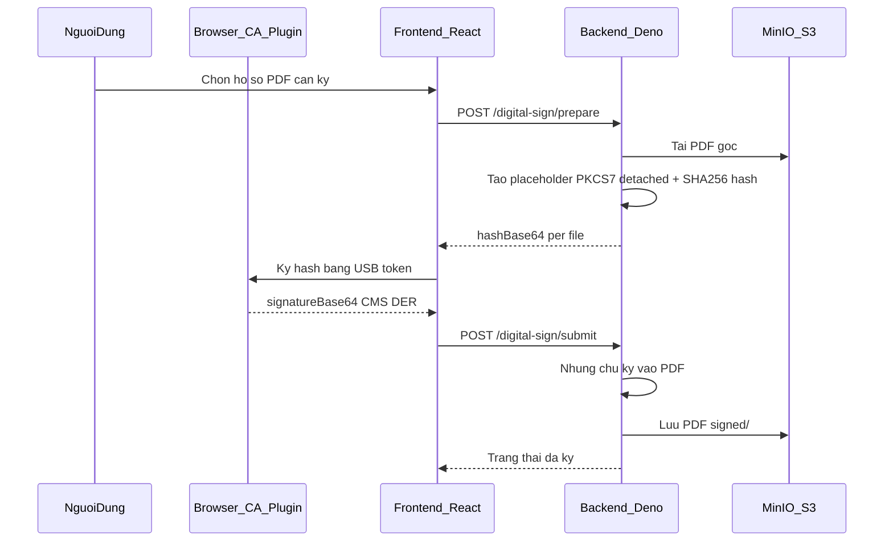
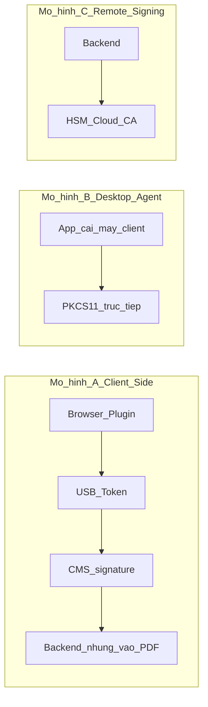

# Lộ trình tích hợp chữ ký số (USB Token) — Node.js/Deno

## Bối cảnh quan trọng

**Runtime thực tế:** Backend dự án chạy trên **Deno** (không phải Node.js thuần), nhưng dùng **Node HTTP**, npm packages (`pdf-lib`, `node-forge`, `mupdf`) và pattern giống Node.js. Khi học tài liệu "Node.js signing", bạn vẫn áp dụng được — chỉ cần chú ý import/`deno task` thay vì `npm start`.

**Tin tốt:** Codebase **đã có ~70% nền tảng ký số**. Bạn không bắt đầu từ số 0 — lộ trình nên tập trung **hiểu sâu kiến trúc hiện có** rồi mới bổ sung phần còn thiếu.




---

## Phần 1: Nền tảng kiến thức (2–3 tuần)

### 1.1 Khái niệm pháp lý & kỹ thuật (bắt buộc)


| Khái niệm                  | Cần hiểu gì                                                                          | Liên quan yêu cầu quản lý               |
| -------------------------- | ------------------------------------------------------------------------------------ | --------------------------------------- |
| **Chữ ký điện tử**         | Thay thế chữ ký tay, có giá trị pháp lý khi đủ điều kiện (Luật Giao dịch điện tử VN) | Mục tiêu chính                          |
| **Chứng thư số (CA)**      | VNPT-CA, Viettel-CA, BKAV-CA cấp cert gắn USB token                                  | Đa CA — đã có adapter                   |
| **USB Token / Smart card** | Private key **không rời thiết bị**; ký qua PKCS#11 hoặc plugin trình duyệt           | Yêu cầu USB token                       |
| **PKCS#7 / CMS**           | Định dạng gói chữ ký detached gắn vào PDF                                            | Backend hiện dùng `adbe.pkcs7.detached` |
| **PAdES / PDF signing**    | Chuẩn ký PDF: ByteRange, incremental update, signature dictionary                    | Core backend logic                      |
| **Chữ ký ẩn vs hiển thị**  | Cryptographic signature ≠ khối chữ ký nhìn thấy trên trang                           | **Gap chính** cho "cấu hình vị trí"     |


**Tài liệu nên đọc (theo thứ tự):**

1. ETSI EN 319 142 (PAdES) — overview, không cần đọc hết
2. Adobe PDF Signature spec (`/SubFilter /adbe.pkcs7.detached`)
3. Tài liệu SDK từng CA: VNPT eSign, Viettel CA Plugin, BKAV Plugin
4. OWASP: không để private key trên server khi dùng USB token

### 1.2 Mô hình triển khai tại Việt Nam (chọn đúng hướng)

Có 3 mô hình phổ biến:




**Dự án đang dùng Mô hình A** — phù hợp USB token đa CA, không cần cài app riêng nếu plugin hoạt động ổn. Đây là lựa chọn đúng cho web app + nhiều nhà cung cấp.

**Không nên** đưa private key lên server Node.js/Deno khi yêu cầu là USB token cá nhân.

### 1.3 Công nghệ trong stack hiện tại


| Layer                 | Thư viện / module                    | File tham khảo                                                                                                                                    |
| --------------------- | ------------------------------------ | ------------------------------------------------------------------------------------------------------------------------------------------------- |
| PDF hash + embed CMS  | `node-forge`, custom incremental PDF | `[digital-sign-pdf-utils.ts](d:\FSI\Code\backend\fsi_bigdata_platform\packages\sohoa-backend\modules\digital-sign\digital-sign-pdf-utils.ts)`     |
| API orchestration     | Elysia service                       | `[digital-sign-service.ts](d:\FSI\Code\backend\fsi_bigdata_platform\packages\sohoa-backend\modules\digital-sign\digital-sign-service.ts)`         |
| Lưu trữ               | MinIO `raw/` → `signed/`             | `[digital-sign-s3-utils.ts](d:\FSI\Code\backend\fsi_bigdata_platform\packages\sohoa-backend\modules\digital-sign\digital-sign-s3-utils.ts)`       |
| CA plugin FE          | VNPT/Viettel/BKAV adapters           | `[src/lib/ca-sign/](d:\FSI\Code\frontend\fsi_bigdata_platform\src\lib\ca-sign\)`                                                                  |
| Ký hàng loạt UI       | Batch drawer + signing runner        | `[BatchDigitalSignDrawer.tsx](d:\FSI\Code\frontend\fsi_bigdata_platform\src\features\digital-sign\components\BatchDigitalSignDrawer.tsx)`         |
| Cấu hình vị trí (mẫu) | Watermark placement canvas           | `[WatermarkPlacementCanvas.tsx](d:\FSI\Code\frontend\fsi_bigdata_platform\src\features\watermark-config\components\WatermarkPlacementCanvas.tsx)` |


---

## Phần 2: Đọc hiểu code hiện có (1–2 tuần)

### 2.1 Luồng ký đơn lẻ — đọc theo thứ tự

1. **Frontend:** `[signingRunner.ts](d:\FSI\Code\frontend\fsi_bigdata_platform\src\features\digital-sign\lib\signingRunner.ts)` — queue, gọi CA, submit
2. **CA adapter:** `[vnpt-adapter.ts](d:\FSI\Code\frontend\fsi_bigdata_platform\src\lib\ca-sign\adapters\vnpt-adapter.ts)` — API `listCerts`, `signHash`
3. **API client:** `[digitalSignClient.ts](d:\FSI\Code\frontend\fsi_bigdata_platform\src\features\digital-sign\api\digitalSignClient.ts)`
4. **Backend prepare:** tạo hash từ PDF + placeholder 8192 hex chars
  1. **Backend submit:** nhúng CMS, upload `signed/`, ghi `digital_signatures` + `signedFilePath`
5. **UI tích hợp:** `[RecordDetailPanel.tsx](d:\FSI\Code\frontend\fsi_bigdata_platform\src\features\data-management\components\RecordDetailPanel.tsx)` — chỉ khi `APPROVED` + quyền `canDigitalSign`

### 2.2 Luồng ký hàng loạt — đã có sẵn

- API: `POST /digital-sign/batch/prepare` + `/batch/submit`
- UI: chế độ batch trong `[DataManagementPage.tsx](d:\FSI\Code\frontend\fsi_bigdata_platform\src\features\data-management\components\DataManagementPage.tsx)`
- **Học thêm:** cơ chế pause/resume, xử lý lỗi từng file, PIN token timeout

### 2.3 Gap so với yêu cầu quản lý


| Yêu cầu                      | Trạng thái                 | Ghi chú                                                        |
| ---------------------------- | -------------------------- | -------------------------------------------------------------- |
| Ký số thay chữ ký tay        | **Có (mức cryptographic)** | Chữ ký hợp lệ trong PDF reader, chưa có khối hiển thị          |
| USB token                    | **Có**                     | Qua plugin CA trình duyệt                                      |
| Ký hàng loạt                 | **Có**                     | Data management; chưa có ở archive                             |
| Cấu hình vị trí hiển thị     | **Chưa có**                | Cần widget `/Rect` + appearance stream hoặc stamp trước khi ký |
| Bắt buộc ký trước lưu trữ    | **Chưa enforce**           | Archive submit không check `signedFilePath`                    |
| Xuất/lưu trữ dùng bản signed | **Chưa**                   | Export AIP vẫn dùng `filePath` gốc                             |
| Xác thực chuỗi chứng thư     | **Một phần**               | Parse PKCS#7, chưa verify trust chain/OCSP                     |


---

## Phần 3: Lộ trình triển khai (khi sẵn sàng code)

### Giai đoạn 0 — Chuẩn bị môi trường (3–5 ngày)

- Cài plugin CA (VNPT/Viettel/BKAV) trên máy test
- Cắm USB token, xác nhận cert hiển thị trong plugin
- Chạy dev: backend `deno task dev`, frontend `npm run dev`
- Test end-to-end trên màn **Quản lý dữ liệu** → hồ sơ `APPROVED` → Ký số
- Ghi lại: browser hỗ trợ (thường Chrome/Edge), lỗi thường gặp (plugin blocked, PIN sai)

### Giai đoạn 1 — Hoàn thiện ký số cơ bản (2 tuần)

**Mục tiêu:** Ký ổn định, audit đầy đủ, enforce workflow.

```
packages/sohoa-backend/
├── modules/digital-sign/
│   ├── [update] digital-sign-service.ts      # check dossier APPROVED, idempotent re-sign
│   └── [update] digital-sign-repo.ts           # query signed status
├── modules/archive/
│   └── [update] archive-submission-service.ts  # optional: require all PDFs signed
└── tests/
    └── [new] digital-sign.integration.test.ts

src/features/digital-sign/
├── [update] components/*                       # error UX, retry
└── [new] queries.ts                            # tách query options
```

- Enforce `dossier.status === APPROVED` trước prepare/submit
- Integration test: prepare → mock CMS → submit → verify `signedFilePath`
- Tài liệu vận hành: hướng dẫn cài plugin cho từng CA

### Giai đoạn 2 — Cấu hình vị trí hiển thị chữ ký (3–4 tuần) — **phần khó nhất**

Hiện tại ký **ẩn** (incremental PKCS#7). Để có **khối chữ ký nhìn thấy** cần:

1. **Schema cấu hình** (tham khảo watermark):
  - `page` (số trang hoặc `last`)
  - `x, y, width, height` (PDF points, gốc bottom-left)
  - `preset`: `bottom_right`, `custom`, ...
  - Gắn theo: loại tài liệu / nhóm / template
2. **Backend — trước khi prepare:**
  - Dùng `pdf-lib` vẽ appearance (ảnh chữ ký + tên + ngày) **hoặc** tạo AcroForm signature field với `/Rect`
  - Sau đó mới `preparePdfForSigning()` trên PDF đã có widget
3. **Frontend — UI cấu hình:**
  - Tái sử dụng pattern từ `[WatermarkPlacementEditor.tsx](d:\FSI\Code\frontend\fsi_bigdata_platform\src\features\watermark-config\components\WatermarkPlacementEditor.tsx)`
  - Route mới: `/app/data-config/signature-placements` (tương tự watermark-configs)

```
src/features/signature-config/          (new)
├── components/SignaturePlacementCanvas.tsx
├── api/signatureConfigClient.ts
└── schemas.ts

packages/sohoa-backend/modules/signature-config/  (new)
├── signature-config-service.ts
└── signature-config.router.ts
```

**Lưu ý kỹ thuật:** Vẽ appearance **trước** ký; sau khi ký, hash ByteRange phải tính trên PDF đã có widget. Một số CA plugin hỗ trợ ký có appearance — cần đối chiếu SDK từng CA.

### Giai đoạn 3 — Ký hàng loạt nâng cao + Archive (2 tuần)

- Mở rộng batch signing sang **Nộp lưu trữ** / **Kho dữ liệu**
- Progress bar tổng: `đã ký / tổng file / lỗi`
- Resume session khi token timeout giữa chừng
- Archive export ưu tiên `signedFilePath` nếu có

### Giai đoạn 4 — Xác thực & tuân thủ (2–3 tuần)

- Verify chuỗi chứng thư (root CA VN)
- OCSP/CRL check (nếu CA cung cấp endpoint)
- Timestamp authority (TSA) — tùy yêu cầu pháp lý PAdES-T
- Báo cáo audit: ai ký, lúc nào, cert thumbprint, dossier/file

### Giai đoạn 5 — UAT & đưa vào vận hành (1–2 tuần)

- Test matrix: 3 CA × 2 browser × single/batch × PDF 1/trang/nhiều trang
- Kiểm tra Adobe Reader / Foxit hiển thị chữ ký hợp lệ
- Đào tạo người dùng: cắm token, nhập PIN, xử lý lỗi plugin

---

## Phần 4: Checklist học tập cá nhân (theo tuần)

### Tuần 1–2: Lý thuyết

- [ ] Đọc luồng PKCS#7 detached signing trên PDF
- [ ] Cài 1 plugin CA, ký thử file PDF bằng tool desktop của CA
- [ ] So sánh: chữ ký ẩn (Properties → Signatures) vs chữ ký có khối hiển thị

### Tuần 3: Đọc backend

- [ ] Trace `preparePdfForSigning` → `embedSignatureInPreparedPdf` trong `digital-sign-pdf-utils.ts`
- [ ] Hiểu `ByteRange` và vì sao hash phải tính trên 2 vùng byte
- [ ] Đọc schema `digital_signatures` và `dossier_files.signedFilePath`

### Tuần 4: Đọc frontend

- [ ] Trace `signingRunner.ts` từ prepare đến submit
- [ ] Đọc 3 CA adapters; ghi API khác nhau giữa VNPT/Viettel/BKAV
- [ ] Test batch signing trên dev environment

### Tuần 5: Thiết kế vị trí chữ ký

- [ ] Đọc module watermark-config (placement %, preset positions)
- [ ] Nghiên cứu PDF signature widget `/Rect` trong spec Adobe
- [ ] Phác thảo ERD: `signature_placement_configs` ↔ document type / group

### Tuần 6: Tích hợp nghiệp vụ

- [ ] Vẽ sơ đồ: QC APPROVED → Ký số → Nộp lưu trữ → Duyệt lưu trữ
- [ ] Liệt kê rule nghiệp vụ: bắt buộc ký 100% file PDF? ký lại khi đổi file?

---

## Phần 5: Rủi ro & quyết định kiến trúc


| Rủi ro                                | Mức        | Giảm thiểu                                    |
| ------------------------------------- | ---------- | --------------------------------------------- |
| Plugin CA không chạy trên browser mới | Cao        | Chuẩn hóa Chrome/Edge; hướng dẫn IT whitelist |
| Mỗi CA có API plugin khác nhau        | Trung bình | Giữ `CaAdapter` interface — đã có             |
| Ký có appearance làm thay đổi hash    | Cao        | Thứ tự: stamp → prepare → sign; test kỹ       |
| User rút token giữa batch             | Trung bình | Queue + retry + lưu trạng thái từng file      |
| Yêu cầu pháp lý PAdES-B/T/LT          | Tùy đơn vị | Tra cứu CA về TSA, LTV                        |


**Quyết định đã đúng trong dự án:** Client-side signing + server embed — phù hợp USB token đa CA trên web app.

**Quyết định cần làm khi triển khai vị trí chữ ký:** Appearance do server render (ảnh + text) hay do plugin CA render — nên prototype cả hai với VNPT trước.

---

## Kết luận cho vai trò quản lý kỹ thuật

Yêu cầu quản lý **không cần xây lại từ đầu**. Hệ thống đã có:

- USB token qua plugin đa CA (VNPT/Viettel/BKAV)
- API + UI ký đơn và ký hàng loạt
- Lưu PDF đã ký riêng trên MinIO

Phần cần đầu tư thêm chủ yếu là:

1. **Cấu hình vị trí hiển thị** (chưa có — học từ watermark-config)
2. **Siết workflow** (ký trước lưu trữ, dùng bản signed khi export)
3. **Xác thực chứng thư đầy đủ** (OCSP/trust chain)

Ước lượng khi triển khai code: **8–12 tuần** (1 dev fullstack có kinh nghiệm), trong đó giai đoạn vị trí chữ ký chiếm ~30–40% effort.