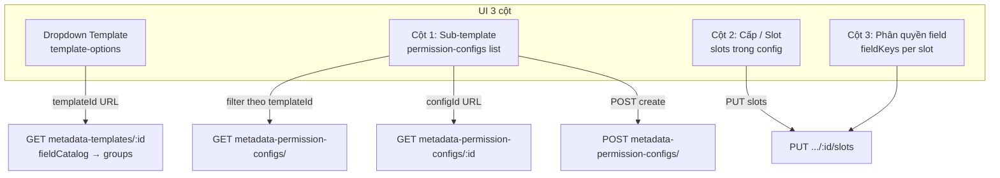

# Kết nối backend trang Document Assignment

## Mô hình dữ liệu (đã làm rõ)



**Phân cấp đúng:**
- **Template** = metadata template (dropdown từ `template-options`)
- **Sub-template** = metadata-permission-config (nhiều config / 1 template)
- **Cấp (Slot)** = `slots[]` trong config (`slotCode`, `slotName`, `fieldKeys`)
- **Field** = checkbox tree từ `fieldCatalog` của template

## Cây file ảnh hưởng

```
src/
├── features/
│   └── data-config/
│       ├── api/
│       │   ├── metadataTemplateClient.ts          (modified — thêm getMetadataTemplateById)
│       │   └── metadataPermissionConfigClient.ts    (new)
│       ├── components/
│       │   └── DocumentAssignmentConfigPage.tsx     (modified — refactor UI + API)
│       ├── lib/
│       │   ├── assignmentHelpers.ts                 (giữ — wildcard logic đã khớp backend)
│       │   └── metadataTemplateHelpers.ts           (giữ — fieldCatalogToGroups)
│       ├── queries.ts                               (modified — thêm query/mutation options)
│       ├── schemas.ts                               (modified — URL search + form Zod)
│       ├── store.ts                                 (modified — xóa assignment logic, giữ nếu còn dùng)
│       └── types.d.ts                               (modified — thêm permission config types)
├── app/
│   └── routes/
│       └── app/
│           └── data-config/
│               └── document-assignment.tsx          (modified — loader prefetch mới)
└── lib/
    └── i18n/
        └── locales/
            ├── en/data-config.json                  (modified)
            └── vi/data-config.json                  (modified)
```

## 1. Types & API client

Thêm types trong [`src/features/data-config/types.d.ts`](src/features/data-config/types.d.ts):

```typescript
// Template option cho dropdown
MetadataPermissionTemplateOptionT { id, name, updatedAt }

// List item từ GET /metadata-permission-configs/
MetadataPermissionConfigListItemT {
  id, name, description, templateId, status,
  createdAt, updatedAt, slotCount,
  template: { id, name }
}

// Slot trong config detail
MetadataPermissionSlotT {
  slotCode, slotName, sortOrder, fieldKeys: string[]
}

// Detail từ GET /metadata-permission-configs/:id
MetadataPermissionConfigT extends list fields + {
  template: { id, name, fieldCatalog },
  slots: MetadataPermissionSlotT[]
}
```

Tạo [`src/features/data-config/api/metadataPermissionConfigClient.ts`](src/features/data-config/api/metadataPermissionConfigClient.ts):

| Function | Endpoint | Response |
|----------|----------|----------|
| `getPermissionTemplateOptions` | `GET .../template-options` | `Array<MetadataPermissionTemplateOptionT>` (trả thẳng) |
| `getPermissionConfigs` | `GET .../metadata-permission-configs/` | `Array<MetadataPermissionConfigListItemT>` |
| `getPermissionConfig` | `GET .../metadata-permission-configs/:id` | `MetadataPermissionConfigT` (unwrap `record` nếu có) |
| `createPermissionConfig` | `POST .../metadata-permission-configs/` | `MetadataPermissionConfigT` |
| `updatePermissionConfigSlots` | `PUT .../metadata-permission-configs/:id/slots` | `MetadataPermissionConfigT` hoặc slots |

Bổ sung `getMetadataTemplateById(id)` trong [`metadataTemplateClient.ts`](src/features/data-config/api/metadataTemplateClient.ts) → `GET /api/v1/admin/metadata-templates/:id`.

**Lưu ý unwrap:** Kiểm tra response thực tế khi implement — list/options trả mảng trực tiếp (giống `getMetadataTemplates`), detail/create có thể wrap `{ record }` — dùng pattern defensive như `createMetadataTemplate`.

## 2. Queries & mutations

Mở rộng [`src/features/data-config/queries.ts`](src/features/data-config/queries.ts):

- `permissionTemplateOptionsQueryOptions()` — dropdown
- `permissionConfigsQueryOptions()` — list tất cả, filter client-side theo `templateId`
- `permissionConfigQueryOptions(configId)` — detail + slots (`enabled: !!configId`)
- `metadataTemplateDetailQueryOptions(templateId)` — detail template (`enabled: !!templateId`)
- `useCreatePermissionConfig()` — POST, invalidate list + navigate `configId`
- `useUpdatePermissionConfigSlots()` — PUT slots, invalidate detail + list

## 3. URL state

Cập nhật [`schemas.ts`](src/features/data-config/schemas.ts):

```typescript
documentAssignmentSearchSchema = z.object({
  templateId: z.string().optional(),
  configId: z.string().optional(),   // sub-template (thay levelId cũ)
  slotCode: z.string().optional(),   // cấp/slot (thay levelId)
})
```

**Auto-resolve** (giữ pattern hiện tại):
1. Chọn template đầu tiên nếu URL thiếu/invalid
2. Filter sub-templates theo `templateId` → chọn `configId` đầu tiên
3. Chọn `slotCode` đầu tiên trong config detail

## 4. Refactor UI — `DocumentAssignmentConfigPage`

File: [`DocumentAssignmentConfigPage.tsx`](src/features/data-config/components/DocumentAssignmentConfigPage.tsx)

### Header (thay cột template trái)

- `Select` dropdown template (pattern từ [`GroupConfigTemplateSelect.tsx`](src/features/group/components/GroupConfigTemplateSelect.tsx))
- Hiển thị mô tả template + thông tin `sourceDossier` từ `metadataTemplateDetailQueryOptions`
- Loading/error states cho từng query (giống [`DocumentTypeConfigPage.tsx`](src/features/data-config/components/DocumentTypeConfigPage.tsx))

### Layout 3 cột (đổi tên cột)

| Cột | Nội dung | API |
|-----|----------|-----|
| **Sub-template** | Danh sách config lọc theo template, nút **Thêm**, `StatusBadge` status, hiển thị `slotCount` | List + POST |
| **Cấp (Slot)** | Danh sách slots, thêm/xóa/đổi tên | Local draft → PUT slots |
| **Phân quyền field** | `MetadataFieldCheckboxTree` với `fieldCatalog` của template | Local draft → PUT slots |

### Thêm sub-template

Dialog form (TanStack Form + Zod):
- `name`, `description` (required name)
- `templateId` = template đang chọn (hidden/auto)
- POST → navigate tới `configId` mới

### Quản lý slot

- **Thêm slot:** dialog nhập `slotName` → generate `slotCode` (`Editor{N}` hoặc `slot-{timestamp}`) + `sortOrder` = length
- **Xóa slot:** confirm dialog → loại khỏi mảng slots
- **Đổi tên:** inline hoặc dialog nhỏ
- Tất cả thay đổi slot/field giữ trong **local draft state** (`useState`), nút **Lưu** gọi `PUT .../slots` với toàn bộ mảng `slots`

**Lý do draft + Save:** Mỗi toggle field sẽ gửi PUT toàn bộ slots — tránh spam API; pattern tương tự [`FieldAssignmentDialog`](src/features/group/components/FieldAssignmentDialog.tsx).

### Field assignment

- Reuse `assignmentHelpers.ts` (`toggleField`, `toggleGroupFields`, wildcard `groupCode.*`) — đã khớp format backend
- `allowedFields` = `slots.find(s => s.slotCode === selected).fieldKeys`
- Schema tree = `fieldCatalogToGroups(template.fieldCatalog)`

### Xóa TanStack Store assignment

- Gỡ `useDataConfigStore`, `dataConfigStore.addLevel/removeLevel/toggle*` khỏi page
- Có thể xóa `assignmentsByTemplateId` khỏi [`store.ts`](src/features/data-config/store.ts) nếu không còn reference (kiểm tra `removeTemplateAssignments` từ document-types)

## 5. Route loader

[`document-assignment.tsx`](src/app/routes/app/data-config/document-assignment.tsx):

```typescript
loader: async ({ context }) => {
  await Promise.all([
    context.queryClient.ensureQueryData(permissionTemplateOptionsQueryOptions()),
    context.queryClient.ensureQueryData(permissionConfigsQueryOptions()),
  ])
}
```

Prefetch template detail + config detail theo URL search params nếu có (optional, trong loader hoặc component).

## 6. i18n

Cập nhật [`en/data-config.json`](src/lib/i18n/locales/en/data-config.json) và [`vi/data-config.json`](src/lib/i18n/locales/vi/data-config.json):

- Đổi label cột: `template` → dropdown label, thêm `subTemplate`, giữ `level` → `slot` hoặc `level`
- Thêm keys: `subTemplates.add`, `subTemplates.addTitle`, `subTemplates.empty`, `subTemplates.createSuccess`
- Thêm `saveSlots`, `saveSlotsSuccess`, `status.draft`, `status.ready`
- Form create sub-template: `nameLabel`, `descriptionLabel`, placeholders

## Luồng người dùng

1. Mở trang → dropdown hiển thị templates từ `template-options`
2. Chọn template → load chi tiết template + lọc sub-templates theo `templateId`
3. Chọn sub-template → load slots từ `GET /:configId`
4. Chọn cấp → chỉnh checkbox field → **Lưu** → `PUT /:configId/slots`
5. Thêm sub-template mới → POST → tự chọn config vừa tạo

## Phạm vi ngoài (chưa có API từ user)

- Xóa sub-template (DELETE)
- Sửa tên/mô tả sub-template sau khi tạo (PUT metadata)
- Publish/change status (`draft` → `ready`)

Có thể bổ sung sau khi backend cung cấp endpoint.

## Kiểm tra sau implement

- Dropdown chỉ dùng `template-options`, không dùng `metadata-templates` list
- Sub-template list filter đúng theo template đã chọn
- Wildcard `BAN_AN_QUYET_DINH.*` hoạt động khi toggle group
- URL deep-link: `?templateId=...&configId=...&slotCode=...`
- Không còn hardcoded UI strings
- Loading/error cho mỗi vùng dữ liệu
