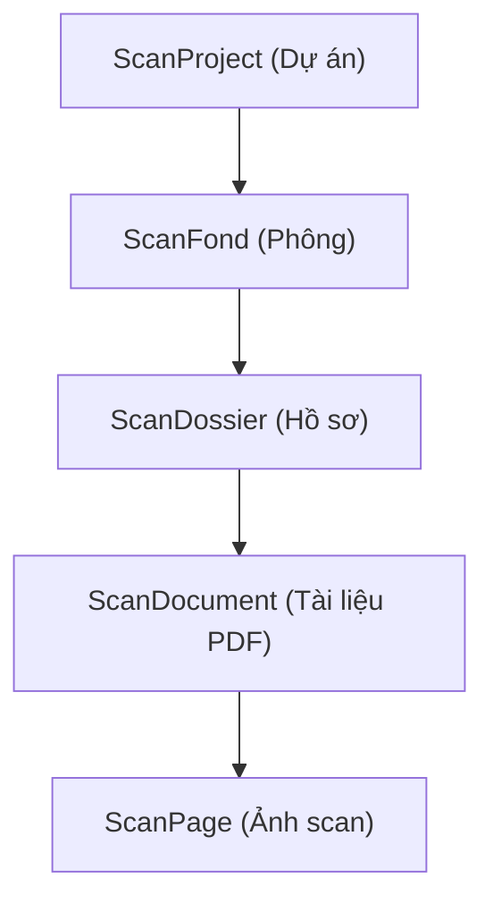
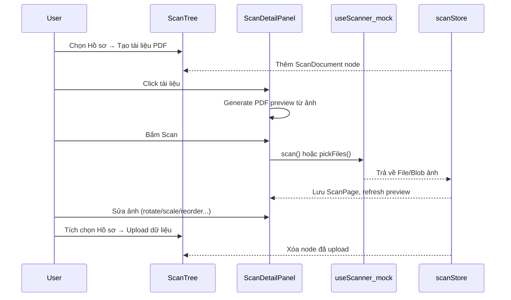

# Kế hoạch: Trang Scan tài liệu (MVP mock)

## Phạm vi & quyết định kiến trúc

| Quyết định | Lựa chọn |
|---|---|
| Entry point | Chỉ nút **"+"** trên sidebar → `navigate({ to: '/app/document-scan' })` |
| Phân quyền | **Admin only** — `requireAppRole(context, 'admin')` trong route guard |
| Backend | **Mock hoàn toàn** — TanStack Store + `localStorage` persistence; API client stub sẵn interface cho phase 2 |
| Scan MVP | Nút Scan → dialog chọn: **(a) sinh ảnh mẫu ngẫu nhiên** hoặc **(b) chọn file ảnh**; kiến trúc sẵn hook `useScanner()` để thay TWAIN sau |
| Phông | Entity **mới**, tách biệt khỏi `data-management` folder; dùng thuật ngữ lưu trữ đúng nghĩa |
| Tái sử dụng | Tham khảo layout [`DataManagementPage`](src/features/data-management/components/DataManagementPage.tsx) và pattern tree [`DataFolderTree`](src/features/data-management/components/DataFolderTree.tsx); **không** abstract sang `common/` (Rule of Three) |

## Cấu trúc phân cấp dữ liệu



**Quy tắc nghiệp vụ:**
- CRUD trên: Dự án, Phông, Hồ sơ, Tài liệu (dialog form + TanStack Form + Zod)
- Ảnh scan: chỉ thao tác inline (rename, reorder, rotate, scale, delete) — không CRUD dialog riêng
- Multi-select checkbox: **chỉ** trên Dự án / Phông / Hồ sơ
- Upload batch: gom toàn bộ tài liệu + ảnh con của node đã chọn → mock mutation → **xóa node khỏi cây**
- Preview PDF: khi chọn Tài liệu, generate PDF blob từ danh sách ảnh (thứ tự `sortOrder`) qua `jsPDF`, hiển thị bằng [`PdfViewer`](src/components/common/PdfViewer.tsx)

## Luồng người dùng



## Cấu trúc file

```
src/
├── features/
│   └── document-scan/
│       ├── types.d.ts                          (new)
│       ├── schemas.ts                          (new)
│       ├── queries.ts                          (new — queryOptions + mutations mock)
│       ├── store.ts                            (new — TanStack Store + localStorage sync)
│       ├── api/
│       │   └── scanClient.ts                   (new — stub interface, mock impl)
│       ├── lib/
│       │   ├── scanTreeUtils.ts                (new — findNode, collectDescendants...)
│       │   ├── generatePdfFromImages.ts        (new — jsPDF từ ScanPage[])
│       │   ├── imageTransform.ts               (new — rotate/scale canvas)
│       │   └── mockScanner.ts                  (new — sinh ảnh / file picker)
│       ├── hooks/
│       │   └── useScanner.ts                   (new — abstraction cho TWAIN phase 2)
│       └── components/
│           ├── DocumentScanPage.tsx            (new — orchestrator)
│           ├── ScanTree.tsx                    (new — tree + checkbox multi-select)
│           ├── ScanTreeNode.tsx                (new)
│           ├── ScanDetailPanel.tsx             (new — panel phải theo node type)
│           ├── ScanDocumentPanel.tsx           (new — preview PDF + scan + image grid)
│           ├── ScanPageThumbnail.tsx           (new — thumbnail + action menu)
│           ├── ScanPageEditor.tsx              (new — rotate/scale preview)
│           ├── ScanPageReorderList.tsx         (new — @dnd-kit sortable)
│           ├── ScanUploadToolbar.tsx           (new — upload batch button)
│           ├── ScanNodeFormDialog.tsx            (new — CRUD Dự án/Phông/Hồ sơ/Tài liệu)
│           └── ScanDeleteDialog.tsx            (new)
├── app/routes/app/
│   └── document-scan/
│       └── index.tsx                           (new — route admin-only)
├── features/navigation/components/
│   └── AppShell.tsx                            (modified — wire nút "+")
├── types/
│   └── features.d.ts                           (modified — re-export types)
└── lib/i18n/
    ├── config.ts                               (modified — register namespace)
    ├── locales/en/document-scan.json           (new)
    └── locales/vi/document-scan.json           (new)
```

## Chi tiết implementation

### 1. Types (`features/document-scan/types.d.ts`)

```typescript
type ScanNodeType = 'project' | 'fond' | 'dossier' | 'document' | 'page'

interface ScanTreeNodeBase {
  id: string
  type: ScanNodeType
  name: string
  parentId: string | null
  createdAt: string
  updatedAt: string
}

interface ScanPageT {
  id: string
  documentId: string
  name: string
  sortOrder: number
  rotation: 0 | 90 | 180 | 270
  scale: number // 0.5–2.0
  blobUrl: string // object URL từ File/Blob
  mimeType: 'image/png' | 'image/jpeg'
}

// ScanProjectT, ScanFondT, ScanDossierT, ScanDocumentT extend base
// ScanTreeNodeT = union discriminated by type
```

Re-export qua [`src/types/features.d.ts`](src/types/features.d.ts).

### 2. Mock store & persistence

- [`store.ts`](src/features/document-scan/store.ts): TanStack Store chứa `nodes: Map<id, ScanTreeNodeT>` + `pages: Map<id, ScanPageT>`
- Seed data ban đầu bằng `@faker-js/faker` (1 dự án, 2 phông, vài hồ sơ rỗng)
- Sync `localStorage` key `document-scan:workspace` on mỗi mutation
- `queries.ts`: `scanWorkspaceQueryOptions()` đọc từ store; mutations (`useCreateScanNode`, `useUpdateScanNode`, `useDeleteScanNode`, `useAddScanPages`, `useUpdateScanPage`, `useReorderScanPages`, `useUploadScanBatch`) cập nhật store + invalidate query

### 3. Route & admin guard

[`src/app/routes/app/document-scan/index.tsx`](src/app/routes/app/document-scan/index.tsx):

```typescript
beforeLoad: async ({ context }) => {
  await requireAppRole(context, 'admin')
},
validateSearch: (raw) => scanSearchSchema.parse(raw), // ?selectedId=...&uploading=...
component: () => <DocumentScanPage />
```

URL state (theo UI patterns rule):
- `selectedId` — node đang chọn
- `expanded` — comma-separated node IDs (optional, hoặc local state nếu không cần deep link)

**Không** thêm sidebar nav item (theo yêu cầu). Chỉ wire nút "+" trong [`AppShell.tsx`](src/features/navigation/components/AppShell.tsx):

```typescript
<Button onClick={() => navigate({ to: '/app/document-scan' })}>
  <Plus /> {t('actions.addNew')}
</Button>
```

Ẩn nút "+" với non-admin (check `primaryAppRole === 'admin'`).

### 4. UI Layout — `DocumentScanPage`

Bố cục 2 cột giống data-management:

| Trái (280px) | Phải (flex-1) |
|---|---|
| Toolbar: Upload dữ liệu (disabled khi chưa chọn) | |
| `ScanTree` với checkbox trên project/fond/dossier | `ScanDetailPanel` theo `selectedNode.type` |
| Nút context: Thêm con / Sửa / Xóa | |

**Khi chọn `document`:**
- Header: tên tài liệu + actions (Scan, Sửa, Xóa)
- Vùng trên: `PdfViewer` với blob URL generate từ ảnh (debounce khi ảnh thay đổi)
- Vùng dưới: grid thumbnail ảnh (`ScanPageThumbnail`) — click mở `ScanPageEditor` sheet

**Khi chọn `page`:**
- `ScanPageEditor`: preview lớn + slider rotate (0/90/180/270) + slider scale + rename input + delete

### 5. Scan MVP (`useScanner` + `mockScanner`)

```typescript
// hooks/useScanner.ts
interface ScannerResult { files: File[] }
interface ScannerAdapter {
  scan(): Promise<ScannerResult>
  pickFiles(): Promise<ScannerResult>
}
// MVP: mockScannerAdapter — sinh canvas PNG ngẫu nhiên HOẶC <input type="file" accept="image/*" multiple>
// Phase 2: twainScannerAdapter implements cùng interface
```

Khi bấm **Scan** trên tài liệu → `AlertDialog` hoặc `DropdownMenu`:
- "Scan (mock)" → `adapter.scan()` → append pages với `sortOrder` tiếp theo
- "Chọn file ảnh" → `adapter.pickFiles()`

### 6. Thao tác ảnh

| Thao tác | Implementation |
|---|---|
| Đổi tên | Inline edit / dialog → `useUpdateScanPage` |
| Đổi vị trí | `@dnd-kit/sortable` trong `ScanPageReorderList` → cập nhật `sortOrder` |
| Xoay | `rotation` field + `imageTransform.ts` (canvas) khi generate PDF |
| Scale | `scale` field (slider 50%–200%) áp dụng khi render preview & export PDF |
| Xóa | `AlertDialog` confirm → revoke blob URL → xóa page |

Package `@dnd-kit/*` đã có trong [`package.json`](package.json) nhưng chưa dùng — đây là use case đầu tiên hợp lý.

### 7. PDF preview từ ảnh

[`lib/generatePdfFromImages.ts`](src/features/document-scan/lib/generatePdfFromImages.ts):
- Input: `ScanPageT[]` sorted by `sortOrder`
- Với mỗi page: load image → apply rotation/scale via canvas → `jsPDF.addImage()` (A4 portrait)
- Output: `Blob` → `URL.createObjectURL` → truyền vào `PdfViewer`
- Revoke URL cũ khi regenerate (tránh memory leak)

Mở rộng logic từ [`src/lib/utils/pdf.ts`](src/lib/utils/pdf.ts) nhưng tách riêng vì use case khác (multi-image, không phải html2canvas).

### 8. Upload batch

`ScanUploadToolbar`:
- Đếm số node đã chọn + tổng tài liệu/ảnh con
- Bấm "Upload dữ liệu" → `AlertDialog` xác nhận
- `useUploadScanBatchMutation`: mock delay 1.5s → toast success → xóa toàn bộ subtree của nodes đã chọn khỏi store
- `scanClient.ts` stub: `uploadScanBatch(payload)` — interface sẵn cho backend phase 2 (tham khảo flow MinIO trong [`dossierClient.ts`](src/features/data-management/api/dossierClient.ts))

### 9. i18n namespace `document-scan`

Keys theo template chuẩn:
- `title`, `tree.*`, `nodeTypes.project/fond/dossier/document/page`
- `actions.scan`, `actions.pickFiles`, `actions.uploadData`, `actions.rotate`, `actions.scale`
- `form.fields.*`, `delete.*`, `upload.confirmTitle`, `upload.success`
- Cả `en` và `vi`

### 10. Phase 2 (không làm trong MVP — ghi chú)

- TWAIN/driver: thay `mockScannerAdapter` bằng adapter thật trong `useScanner`
- Backend API: thay store bằng `scanClient` gọi `apiClient`
- Liên kết `projectCode` với [`ProjectT`](src/features/project-manager/types.d.ts) từ project-manager
- Upload thật qua presigned URL (reuse pattern `dossierClient.ts`)

## Rủi ro & lưu ý

- **Blob URL memory**: luôn `URL.revokeObjectURL` khi xóa ảnh hoặc upload xong
- **PdfViewer worker**: đã config `pdfjs.GlobalWorkerOptions.workerSrc` — blob URL tương thích
- **Không trùng với data-management**: đây là workspace staging riêng; upload mock chỉ xóa local, chưa đẩy vào cây số hóa chính
- **Nút "+" ẩn với non-admin** để tránh redirect access-denied

## Validation checklist (khi hoàn thành)

- i18n: namespace `document-scan`, không hardcode UI strings
- Types: entity types trong `features/document-scan/types.d.ts`
- Patterns: TanStack Form + Zod CRUD, `queryOptions` factory, semantic tokens, URL `selectedId`
- Admin only: `requireAppRole('admin')` + ẩn nút "+" cho non-admin
