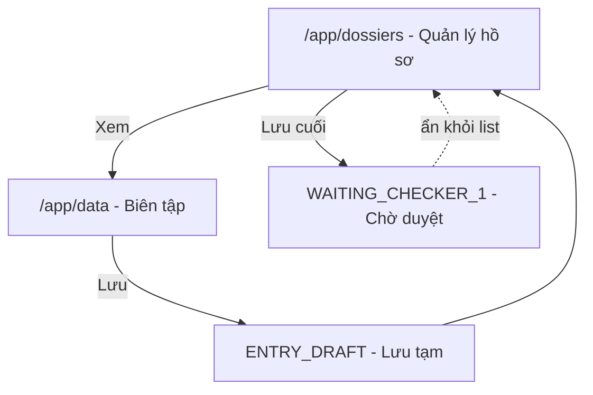

# Kế hoạch: Quản lý hồ sơ & Lưu tạm cho Editor

## Bối cảnh hiện tại

Luồng editor tại [`/app/data`](src/app/routes/app/data/index.tsx) hoạt động theo mô hình **claim → chỉnh sửa → Lưu → claimNext**:


- FE **không** set `dossierStatus` khi lưu — backend xử lý chuyển trạng thái.
- Sau lưu, [`handleMetadataReload`](src/features/data-management/components/DataManagementPage.tsx) gọi `claimNextMutation` (dòng 591–595).
- Đã có sẵn `getDataTree('editor', { refresh: true, dossierId })` để refresh một hồ sơ cụ thể — dùng cho nút **Xem**.

## Luồng mới (mục tiêu)



## Cấu trúc file

```
src/
├── features/
│   └── editor-dossiers/
│       ├── api/
│       │   ├── editorDossierClient.ts      (new) — facade API, gọi mock hoặc BE sau này
│       │   └── editorDossierMockStore.ts   (new) — in-memory + localStorage
│       ├── components/
│       │   ├── EditorDossierManagementPage.tsx  (new)
│       │   └── EditorDossierTable.tsx           (new)
│       ├── queries.ts                      (new)
│       ├── schemas.ts                      (new) — URL search: page, q
│       └── types.d.ts                      (new)
├── features/data-management/
│   ├── types.d.ts                          (modified) — thêm ENTRY_DRAFT
│   ├── schemas.ts                          (modified) — thêm dossierId search param
│   ├── components/
│   │   ├── DataManagementPage.tsx          (modified) — hook lưu tạm sau save
│   │   └── DossierStatusBadge.tsx          (modified) — style ENTRY_DRAFT
│   └── api/
│       └── dataManagementClient.ts         (modified) — mock load dossier by id
├── app/routes/app/
│   └── dossiers/
│       └── index.tsx                       (new)
├── features/navigation/config/
│   └── appNav.ts                           (modified) — menu sidebar
├── features/permissions/config/
│   └── screenPermissionMap.ts              (modified) — APP_SCREEN_ACCESS.dossiers
└── lib/i18n/
    ├── config.ts                           (modified)
    ├── locales/en/editor-dossiers.json     (new)
    ├── locales/vi/editor-dossiers.json     (new)
    ├── locales/en/data-management.json     (modified) — dossierStatus.ENTRY_DRAFT
    ├── locales/vi/data-management.json       (modified)
    ├── locales/en/common.json              (modified) — admin.dossierManagement
    └── locales/vi/common.json              (modified)
```

## Chi tiết triển khai

### 1. Trạng thái mới `ENTRY_DRAFT`

Thêm vào [`DataDossierStatus`](src/features/data-management/types.d.ts):

```typescript
| 'ENTRY_DRAFT'  // Lưu tạm — editor đã biên tập xong, chưa gửi duyệt
```

Cập nhật i18n `dossierStatus.ENTRY_DRAFT` = **"Lưu tạm"** và style badge trong [`DossierStatusBadge.tsx`](src/features/data-management/components/DossierStatusBadge.tsx).

Trang quản lý chỉ hiển thị 2 trạng thái:
- `READY_FOR_ENTRY` → **Sẵn sàng nhập liệu**
- `ENTRY_DRAFT` → **Lưu tạm**

### 2. Mock data layer

Tạo [`editorDossierMockStore.ts`](src/features/editor-dossiers/api/editorDossierMockStore.ts):

- Seed ~5 hồ sơ mẫu (mix `READY_FOR_ENTRY` + `ENTRY_DRAFT`).
- Persist qua `localStorage` key `editor-dossiers-mock` để giữ state khi refresh.
- API facade trong `editorDossierClient.ts`:

| Hàm | Mục đích (mock) | API tương lai (placeholder) |
|-----|-----------------|------------------------------|
| `getEditorAssignedDossiers()` | Trả list hồ sơ editor | `GET /api/v1/data-entry/maker/dossiers` |
| `submitEditorDraftSave(dossierId)` | `READY_FOR_ENTRY` → `ENTRY_DRAFT` | `POST .../maker/draft/:id` |
| `submitEditorFinalSave(dossierIds[])` | `ENTRY_DRAFT` → xóa khỏi list (mock: status `WAITING_CHECKER_1`) | `POST .../maker/submit` |

Type entity:

```typescript
export interface EditorAssignedDossierT {
  id: string
  dossierId: string
  name: string
  status: 'READY_FOR_ENTRY' | 'ENTRY_DRAFT'
  updatedAt: string
}
```

### 3. Trang "Quản lý hồ sơ" (`/app/dossiers`)

**Route** [`src/app/routes/app/dossiers/index.tsx`](src/app/routes/app/dossiers/index.tsx) — thin controller:
- `beforeLoad`: `requirePermission({ module: 'data-entry' })`
- `loader`: prefetch `editorAssignedDossiersQueryOptions()`
- `errorComponent` bắt buộc
- `staticData.crumb`: i18n key

**UI** [`EditorDossierManagementPage.tsx`](src/features/editor-dossiers/components/EditorDossierManagementPage.tsx):
- Header + bảng trong `Card`
- Cột: checkbox | Tên | Trạng thái (`DossierStatusBadge`) | Thao tác
- **Xem**: navigate tới `/app/data` với `dossierId` + `nodeId` (cùng giá trị dossierId)
- **Lưu cuối** (chỉ hàng `ENTRY_DRAFT`): gọi mutation → invalidate list → toast success
- Bulk: copy pattern [`UserTable`](src/features/user/components/ManageUser.tsx) — `Set<string>`, select all trên trang, nút **"Lưu cuối ({{count}})"** chỉ enable khi có ít nhất 1 hàng `ENTRY_DRAFT` được chọn
- Checkbox chỉ enable cho hàng `ENTRY_DRAFT` (hàng `READY_FOR_ENTRY` không thể bulk Lưu cuối)

### 4. Thay đổi luồng Lưu tại `/app/data`

Trong [`DataManagementPage.handleMetadataReload`](src/features/data-management/components/DataManagementPage.tsx):

```typescript
if (role === 'editor') {
  await submitEditorDraftSave(reloadDossierId)  // mock: chuyển ENTRY_DRAFT
  await claimNextMutation.mutateAsync()          // giữ UX claim hồ sơ tiếp
  return
}
```

- Toast lưu thành công giữ nguyên.
- Invalidate query `editor-dossiers` sau draft save để list cập nhật.

### 5. Mở hồ sơ cụ thể từ nút "Xem"

**a)** Thêm `dossierId` vào [`dataManagementSearchSchema`](src/features/data-management/schemas.ts).

**b)** Route loader [`/app/data`](src/app/routes/app/data/index.tsx): nếu có `search.dossierId`, gọi `getDataTree('editor', { refresh: true, dossierId })` thay vì claim mặc định.

**c)** Mock load by id trong [`dataManagementClient.ts`](src/features/data-management/api/dataManagementClient.ts):
- Khi `dossierId` được truyền và dossier tồn tại trong mock store → build `editorClaimSnapshot` giả từ mock data (tái sử dụng `assembleEditorTreeFromClaim` structure hoặc helper tương đương với metadata/files stub tối thiểu).
- Cho phép editor xem/chỉnh sửa lại hồ sơ `ENTRY_DRAFT` từ list.

### 6. Navigation & i18n

**Sidebar** — thêm vào [`appNav.ts`](src/features/navigation/config/appNav.ts):

```typescript
{
  id: 'dossiers',
  to: '/app/dossiers',
  labelKey: 'admin.dossierManagement',  // "Quản lý hồ sơ"
  icon: FolderOpen,  // lucide-react
  requiredPermission: { module: 'data-entry' },
}
```

Đặt ngay sau mục `data` (Quản lý dữ liệu) để editor dễ tìm.

**i18n namespace** `editor-dossiers`: `title`, `table.columns.*`, `actions.view`, `actions.finalSave`, `actions.finalSaveSelected`, `table.selectAll`, `empty`, `errors.*`, `success.finalSave`.

### 7. Query layer

[`editor-dossiers/queries.ts`](src/features/editor-dossiers/queries.ts):

```typescript
editorAssignedDossiersQueryOptions()
useSubmitEditorDraftSaveMutation()
useSubmitEditorFinalSaveMutation()  // nhận dossierIds[]
```

Invalidate `editorAssignedDossiers` sau draft/final save.

## Phạm vi ngoài (chờ backend)

- Không gọi API thật cho list/draft/submit — chỉ mock store.
- Không đổi `saveDossierMetadata` PUT — backend vẫn xử lý metadata; mock chỉ quản lý status trong FE store.
- Khi BE sẵn sàng: thay implementation trong `editorDossierClient.ts`, xóa/guard mock store.

## Kiểm tra thủ công

1. Editor login → sidebar thấy **Quản lý hồ sơ** + **Quản lý dữ liệu**
2. `/app/dossiers` hiển thị mock list với 2 loại trạng thái
3. **Xem** → mở `/app/data` đúng hồ sơ (mock tree load)
4. Lưu metadata tại `/app/data` → hồ sơ chuyển **Lưu tạm** trong list
5. **Lưu cuối** đơn lẻ → hồ sơ biến mất khỏi list
6. Chọn nhiều hồ sơ **Lưu tạm** → **Lưu cuối** hàng loạt → tất cả biến mất
7. Hàng **Sẵn sàng nhập liệu** không có nút Lưu cuối, checkbox disabled
