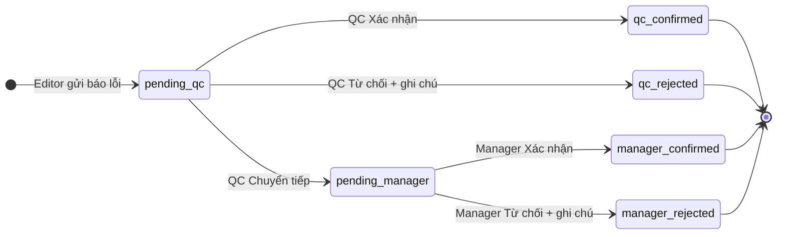

# Kế hoạch: Thông báo lỗi Editor → QC → Manager (mock FE)

## Cây file ảnh hưởng

```
src/features/data-management/
├── api/
│   └── editorErrorReportClient.ts          (new)
├── components/
│   ├── EditorErrorReportDialog.tsx         (new) — modal M1 (editor gửi)
│   ├── EditorErrorReportReviewDialog.tsx   (new) — modal QC/manager xử lý
│   ├── EditorErrorReportAlertBanner.tsx    (new) — banner đỏ trong chi tiết
│   ├── RecordDetailPanel.tsx               (modified) — nút "Báo lỗi" + wire dialog
│   ├── DataFolderTree.tsx                  (modified) — icon/badge đỏ trên node
│   └── DataManagementPage.tsx              (modified) — truyền pending dossier ids
├── hooks/
│   └── useEditorErrorReports.ts            (new)
├── lib/
│   └── editorErrorReportHelpers.ts         (new)
├── store/
│   └── editorErrorReportStore.ts           (new) — TanStack Store + localStorage
├── schemas.ts                              (modified) — Zod submit/reject schemas
├── types.d.ts                              (modified) — EditorErrorReportT
└── config/roleConfig.ts                    (modified) — thêm role `manager`

src/features/auth/constants.ts              (modified) — thêm `manager` vào APP_ROLES
src/lib/i18n/locales/en/data-management.json (modified)
src/lib/i18n/locales/vi/data-management.json (modified)
```

## Luồng nghiệp vụ



**Quy tắc mock:**
- Mỗi `dossierId` chỉ có **1 báo cáo đang chờ xử lý** (`pending_qc` hoặc `pending_manager`).
- Editor không gửi thêm khi đã có báo cáo pending; hiển thị trạng thái "đang chờ QC xử lý".
- Sau khi QC/manager xử lý xong → badge/banner biến mất; editor thấy banner kết quả nếu bị từ chối.

## 1. Data model & mock store

Thêm types vào [`src/features/data-management/types.d.ts`](src/features/data-management/types.d.ts):

```typescript
export type EditorErrorReportTypeT =
  | 'cannot_open_file'
  | 'wrong_highlight'
  | 'other'

export type EditorErrorReportStatusT =
  | 'pending_qc'
  | 'qc_confirmed'
  | 'qc_rejected'
  | 'pending_manager'
  | 'manager_confirmed'
  | 'manager_rejected'

export interface EditorErrorReportT {
  id: string
  dossierId: string
  dossierName: string
  errorType: EditorErrorReportTypeT
  description: string
  reporterId: string
  reporterName: string
  reportedAt: string
  status: EditorErrorReportStatusT
  rejectNote?: string
  reviewedAt?: string
  reviewedByName?: string
}
```

**Store** [`editorErrorReportStore.ts`](src/features/data-management/store/editorErrorReportStore.ts):
- TanStack Store, persist `localStorage` key `data-management:editor-error-reports`
- API mock [`editorErrorReportClient.ts`](src/features/data-management/api/editorErrorReportClient.ts): `submit`, `confirm`, `reject`, `forward`, `listByDossier`, `listPendingForRole`
- Hook [`useEditorErrorReports.ts`](src/features/data-management/hooks/useEditorErrorReports.ts): subscribe store, expose mutations + helpers

Helpers [`editorErrorReportHelpers.ts`](src/features/data-management/lib/editorErrorReportHelpers.ts):
- `getPendingReportForDossier(dossierId, role)` — QC xem `pending_qc`, manager xem `pending_manager`
- `getDossierIdsWithPendingReports(role)` — cho tree badge
- `canEditorSubmitReport(dossierId)` — chặn gửi trùng

## 2. Editor — nút "Báo lỗi" + modal M1

Vị trí: footer tại [`RecordDetailPanel.tsx:1025`](src/features/data-management/components/RecordDetailPanel.tsx) — thêm nút **chỉ khi `isEditorRole`**:

```1025:1096:src/features/data-management/components/RecordDetailPanel.tsx
        <div className="flex shrink-0 justify-end gap-2 border-t border-border pt-2">
          {/* Thêm Button variant="outline" + icon AlertTriangle: "Báo lỗi" */}
          {canExport ? ( ... ) : canShowSubmitButton ? ( ... ) : null}
        </div>
```

**`EditorErrorReportDialog.tsx`** (Dialog + TanStack Form + Zod):
| Field | UI |
|-------|-----|
| Loại lỗi | `Select` — 3 option: không mở được file / highlight sai vị trí / lỗi khác |
| Mô tả lỗi | `Textarea` — required, min length |
| Gửi | `Button` primary — gọi mock submit, toast success, đóng modal |

Pattern tham chiếu: [`QcInlineRejectBar.tsx`](src/features/data-management/components/QcInlineRejectBar.tsx) (textarea + footer actions), [`RevertMetadataHistoryDialog.tsx`](src/features/data-management/components/RevertMetadataHistoryDialog.tsx) (Dialog structure).

## 3. QC — badge trên cây + banner trong chi tiết

### 3a. Badge/icon đỏ trên cây thư mục

Sửa [`DataFolderTree.tsx`](src/features/data-management/components/DataFolderTree.tsx):
- Prop mới: `pendingErrorReportDossierIds?: Set<string>`
- Với node có `dossierId` trong set → hiển thị `AlertCircle` màu `text-destructive` + `title` i18n (tương tự pattern `UserCheck` assigned indicator ở dòng 249–258)

[`DataManagementPage.tsx`](src/features/data-management/components/DataManagementPage.tsx) subscribe hook, tính `pendingErrorReportDossierIds` theo `role`, truyền xuống tree.

### 3b. Banner alert khi mở hồ sơ

**`EditorErrorReportAlertBanner.tsx`** — banner `border-destructive/40 bg-destructive/5` (giống banner QC reject notes editor đang có ở dòng 807–815):
- Text: "Hồ sơ có thông báo lỗi từ editor"
- Nút "Xem chi tiết" → mở review dialog
- Chỉ hiện khi `role === 'qc'` và có report `pending_qc` cho `dossierId` hiện tại

Đặt banner **phía trên** `metadataPanelContent` trong `RecordDetailPanel`.

## 4. Modal xử lý cho QC / Manager

**`EditorErrorReportReviewDialog.tsx`** — Dialog read-only info + action buttons:

| Hiển thị | Nguồn |
|----------|-------|
| Loại lỗi | `errorType` → i18n label |
| Mô tả lỗi | `description` |
| Người thông báo | `reporterName` |
| Thời gian | `reportedAt` → `formatDate` |

**Nút theo role:**

| Role | Nút | Hành vi mock |
|------|-----|-------------|
| `qc` | Xác nhận | `status → qc_confirmed`, toast |
| `qc` | Từ chối | Mở inline textarea ghi chú (required) → `status → qc_rejected` |
| `qc` | Chuyển tiếp tới quản lý | `status → pending_manager`, toast |
| `manager` | Xác nhận / Từ chối | Tương tự, **không có** nút chuyển tiếp |

**Từ chối có ghi chú:** click "Từ chối" → hiện textarea trong cùng dialog (2-step inline, không nested dialog) → confirm.

## 5. Chuẩn bị role Manager (chưa có tài khoản)

- Mở rộng `DataManagementRole` = `'admin' | 'editor' | 'qc' | 'manager'` trong [`roleConfig.ts`](src/features/data-management/config/roleConfig.ts) — permissions tối thiểu (chỉ xem + xử lý error report, không upload/assign).
- Thêm `manager` vào [`auth/constants.ts`](src/features/auth/constants.ts) `APP_ROLES` + `normalizeAppRole` + `getPrimaryAppRole` (ưu tiên: admin > manager > qc > editor).
- Banner + review dialog tự động hoạt động khi user có role `manager` và report ở `pending_manager`.
- **Test tạm (DEV):** ghi chú trong code — có thể set role `manager` trong auth localStorage hoặc dùng tài khoản admin (admin cũng thấy queue manager để test chuỗi forward) — chọn cách đơn giản: **admin có thể xử lý cả QC lẫn manager queue** trong giai đoạn mock.

## 6. Editor nhận phản hồi

Khi report bị từ chối (`qc_rejected` / `manager_rejected`), hiển thị banner tương tự QC reject notes (dòng 807–815) với nội dung `rejectNote` — giúp editor biết lý do.

## 7. i18n

Thêm namespace keys vào `data-management.json` (en + vi):

```
editorErrorReport.title
editorErrorReport.actions.report / submit
editorErrorReport.form.errorType.label
editorErrorReport.form.errorType.cannotOpenFile / wrongHighlight / other
editorErrorReport.form.description.label / placeholder
editorErrorReport.review.title
editorErrorReport.review.reporter / reportedAt
editorErrorReport.review.actions.confirm / reject / forward / rejectNote
editorErrorReport.alert.pendingForQc / pendingForManager / rejected
editorErrorReport.success.submit / confirm / reject / forward
editorErrorReport.errors.submitFailed
editorErrorReport.tree.pendingIndicator
```

## 8. Kiểm tra thủ công (mock)

1. Đăng nhập editor → mở hồ sơ → bấm "Báo lỗi" → điền form → Gửi
2. Đăng nhập QC → thấy icon đỏ trên node hồ sơ trong cây
3. QC mở hồ sơ → thấy banner đỏ → "Xem chi tiết" → thử 3 nút (xác nhận / từ chối / chuyển tiếp)
4. Sau "Chuyển tiếp" → test với role manager (hoặc admin) → xem banner + modal manager (không có nút chuyển tiếp)
5. Editor mở lại hồ sơ bị từ chối → thấy ghi chú từ chối

## Phạm vi ngoài lần này

- Không kết nối API backend
- Không thêm route/tab danh sách riêng (theo lựa chọn: tree + detail)
- Không thêm automated tests
