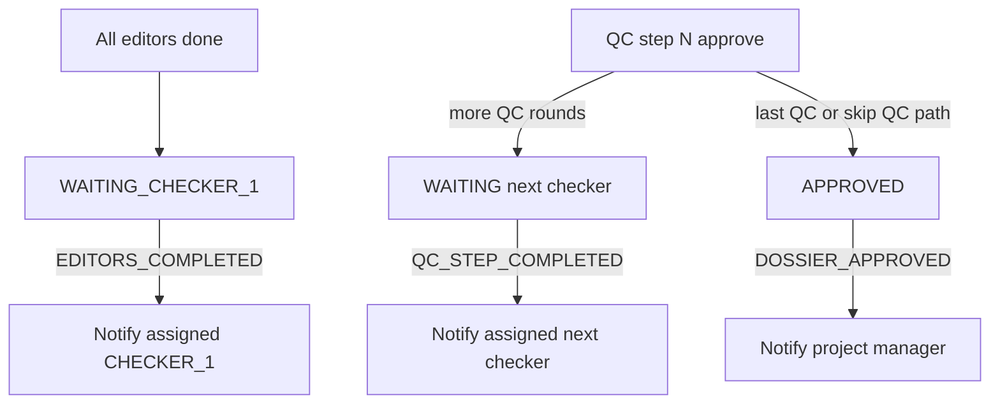

# FE Integration Guide — Workflow Notification Types (Contract-First)

## Mục tiêu

Cho FE tích hợp **3 loại thông báo mới** trên cùng nền tảng đã dùng cho `OCR_COMPLETED` và `DOSSIER_ASSIGNED` (chuông / inbox / cấu hình admin / Socket.IO). Plan này chỉ mô tả **hợp đồng backend** và checklist tích hợp — không giả định cấu trúc hay stack FE.

## Khi nào FE cần đổi code?

Backend không đổi shape API cho inbox/socket. FE chỉ cần đụng code nếu implementation hiện tại **không generic**:

| Khả năng FE | Cần đổi cho 3 type mới? |
|-------------|-------------------------|
| Chuông render theo `title` / `body` (không switch theo `type`) | Không |
| Click chuông điều hướng theo `actionUrl` (hoặc `entityId` + `entityType`) | Chỉ nếu chưa hỗ trợ path mới (xem bảng `actionUrl` bên dưới) |
| Client socket / validator **whitelist** chỉ 2 type cũ | **Có** — type mới sẽ bị bỏ / lỗi parse |
| Màn hình admin cấu hình thông báo: dropdown type **hardcode** 2 giá trị | **Có** — không tạo được config type mới |
| TypeScript / OpenAPI client generate từ BE schema | Cập nhật generate / union type |

**Nguyên tắc khuyến nghị:** coi `type` là string ổn định từ BE; UI chuông không phụ thuộc `type`; admin config map label theo catalog type dưới đây.

## Source of truth (backend)

```text
packages/sohoa-backend/
├── db/schemas/
│   └── notification-constants.ts          # enum type + channel
├── modules/notification/
│   ├── notification-resolver.ts           # title, body, actionUrl, payload
│   ├── notification-delivery-service.ts   # dispatch + schedule
│   ├── notification.router.ts             # inbox user API
│   └── notification.admin-router.ts       # config admin API
└── libs/socket-io.ts                      # event notification:new
```

## Catalog loại thông báo

| `type` | Ý nghĩa nghiệp vụ | Ai thường nhận (qua config `roleIds`) | Ghi chú recipient |
|--------|-------------------|--------------------------------------|-------------------|
| `OCR_COMPLETED` | OCR xong | admin / PM (theo config) | Theo role trong config |
| `DOSSIER_ASSIGNED` | Vừa được phân công | editor / qc của assignee | Chỉ `assigneeId`, giao với role config |
| `EDITORS_COMPLETED` | Tất cả editor biên tập xong → chờ QC bước 1 | `qc` | Chỉ QC đã gán `CHECKER_1`; không gán thì **không gửi** |
| `QC_STEP_COMPLETED` | QC bước trước xong → chờ QC bước sau | `qc` | Chỉ QC đã gán bước tiếp; không gán thì **không gửi** |
| `DOSSIER_APPROVED` | Hồ sơ `APPROVED` (kể cả bỏ qua QC) | `project_manager` | Chỉ `managerId` của project chứa hồ sơ; không có PM thì **không gửi** |

Delivery chỉ xảy ra khi có **notification config active** khớp `type` + channels + role giao với recipient.

## Hợp đồng dữ liệu chung

Mọi type dùng cùng shape inbox / realtime:

```ts
type NotificationInboxItem = {
  id: string
  type: string // một trong catalog trên
  title: string
  body: string
  entityType: string | null // "dossier" với các type hồ sơ
  entityId: string | null   // dossier UUID
  actionUrl: string         // path tương đối — xem bảng dưới
  payload: unknown          // object JSON; field theo type
  readAt: string | null     // ISO datetime hoặc null
  createdAt: string         // ISO datetime
}
```

Realtime push (Socket.IO):

- Event: `notification:new`
- Room: user đang đăng nhập (BE emit theo `user:{userId}`)
- Payload: cùng các field hiển thị chuông: `id`, `type`, `title`, `body`, `actionUrl`, `entityType`, `entityId`, `createdAt` (không bắt buộc kèm full `payload` trên socket — nếu FE cần field phụ, lấy từ REST inbox hoặc dựa `actionUrl` / `entityId`)

## `actionUrl` và điều hướng

BE trả **path tương đối** (không có origin). FE navigate SPA theo `actionUrl`. Email channel: BE ghép `FRONTEND_URL` + relative path thành absolute link.

| `type` | Recipient | `actionUrl` |
|--------|-----------|-------------|
| `OCR_COMPLETED` | admin | `/app/data?dossierId={dossierId}` |
| `DOSSIER_ASSIGNED` | editor | `/app/data` |
| `DOSSIER_ASSIGNED` | qc | `/app/data?dossierId={dossierId}` |
| `EDITORS_COMPLETED` | qc | `/app/data?dossierId={dossierId}` |
| `QC_STEP_COMPLETED` | qc | `/app/data?dossierId={dossierId}` |
| `DOSSIER_APPROVED` | pm | `/app/data?dossierId={dossierId}` |

Đây là catalog cho 5 type hiện tại — không phải quy tắc “mọi thông báo đều mở `/app/data`”. Type mới = template URL mới.

Fallback an toàn nếu thiếu `actionUrl`: dùng `entityType === "dossier"` + `entityId`.

## `payload` theo type (field phụ)

Chỉ cần nếu FE muốn hiển thị/meta ngoài title/body; chuông tối thiểu **không bắt buộc** đọc payload.

**`EDITORS_COMPLETED`**

```ts
{
  dossierId: string
  folderId: string
  workerRole: string // e.g. "CHECKER_1"
  assigneeId: string
  qcStep: number     // 1
}
```

**`QC_STEP_COMPLETED`**

```ts
{
  dossierId: string
  folderId: string
  workerRole: string // e.g. "CHECKER_2"
  assigneeId: string
  completedQcStep: number
  nextQcStep: number
}
```

**`DOSSIER_APPROVED`**

```ts
{
  dossierId: string
  folderId: string
  managerId: string
}
```

Title/body mẫu (BE, tiếng Việt, có thể đổi sau mà không đổi `type`):

- Editors done: title `Hồ sơ chờ QC kiểm tra`
- Next QC: title `Hồ sơ chờ QC bước tiếp theo`
- Approved: title `Hồ sơ đã được duyệt`

## API bề mặt (reuse)

### Inbox (user đã auth)

| Method | Path | Mục đích |
|--------|------|----------|
| GET | `/notifications` | List (`unreadOnly`, `limit`, `offset`) |
| GET | `/notifications/unread-count` | Số chưa đọc |
| POST | `/notifications/:id/read` | Đánh dấu đã đọc |
| POST | `/notifications/read-all` | Đọc hết |

Không có endpoint riêng theo type — type mới xuất hiện trong cùng list.

### Cấu hình (admin, permission `NOTIFICATIONS_CONFIG_MANAGE`)

| Method | Path | Mục đích |
|--------|------|----------|
| CRUD | `/notification-configs` | Tạo/sửa/list/active config |

Body tạo/sửa cần:

- `notificationType`: một trong catalog (gồm 3 type mới)
- `channels`: `system` | `email` (một hoặc nhiều)
- `roleIds`: role auth nhận (sau đó BE giao với recipient cụ thể)
- `active`: boolean

Admin UI cần cho phép chọn 3 giá trị type mới; gợi ý label:

| Type | Label gợi ý (VI) | Mô tả ngắn |
|------|------------------|------------|
| `EDITORS_COMPLETED` | Biên tập xong — chờ QC | Khi mọi editor hoàn tất, báo QC phụ trách |
| `QC_STEP_COMPLETED` | QC bước trước xong | Khi một vòng QC duyệt xong, báo QC bước sau |
| `DOSSIER_APPROVED` | Hồ sơ đã duyệt | Khi hồ sơ APPROVED, báo PM của project |

## Luồng nghiệp vụ (để FE/QA hiểu khi nào có chuông)



## Checklist tích hợp FE (tự đối chiếu)

1. **Catalog type:** mọi chỗ whitelist/enum/dropdown type có đủ 5 giá trị (hoặc chấp nhận string mở + chỉ whitelist phía admin options).
2. **Chuông:** item mới từ REST và từ `notification:new` đều hiện `title`/`body`; badge unread cập nhật.
3. **Click:** `actionUrl` `/app/data` (+ `?dossierId=` khi có) mở đúng màn data; type sau này có thể trỏ route khác.
4. **Admin config:** tạo được config cho 3 type mới; không map nhầm label về OCR.
5. **Không phụ thuộc FE biết workflow nội bộ** — chỉ cần trust BE đã gửi đúng lúc đúng người.

## Kiểm thử chấp nhận (product)

1. Tạo 3 config active (system + role phù hợp).
2. Hồ sơ có CHECKER_1 pre-assign → editor cuối submit → QC1 có thông báo + click vào đúng hồ sơ QC.
3. Có CHECKER_2 → QC1 duyệt → QC2 có thông báo.
4. QC cuối duyệt (hoặc hồ sơ không cần QC) → PM project có thông báo + click vào đúng hồ sơ admin.
5. Không có assignee / không có PM → không có thông báo, workflow vẫn thành công.
6. Config inactive → không tạo thông báo.

## Phạm vi ngoài

- Không yêu cầu FE đổi protocol inbox/socket.
- Không yêu cầu FE implement logic “ai là QC / PM” — BE đã chọn recipient.
- Không nằm trong plan: issue-report / escalate PM (domain khác).
