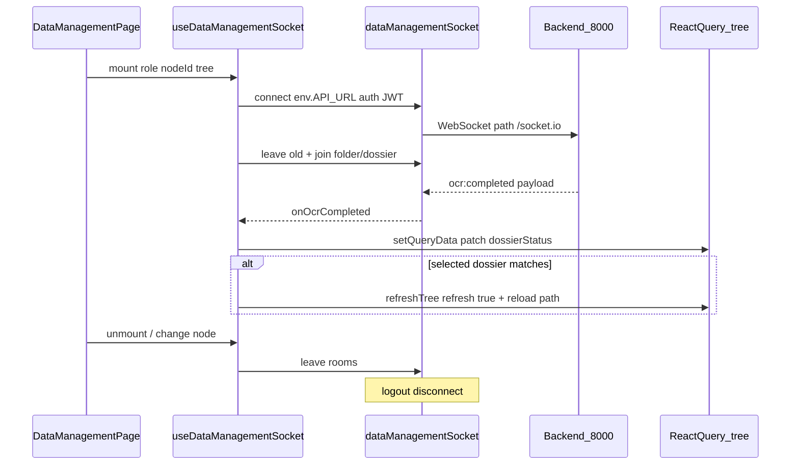

# Kế hoạch tích hợp Socket.IO cho data-management

## Phạm vi

- **Trang áp dụng:** [`DataManagementPage`](src/features/data-management/components/DataManagementPage.tsx) (dùng bởi [`/admin/data`](src/app/routes/admin/data/index.tsx), [`/qc/data`](src/app/routes/qc/data/index.tsx), [`/editor/data`](src/app/routes/editor/data/index.tsx)).
- **Event duy nhất (phase 1):** `ocr:completed`.
- **URL socket:** `env.API_URL` (hiện local `VITE_API_URL=http://localhost:8000`) — không thêm key env; deploy chỉ đổi `VITE_API_URL` như REST.
- **Không đổi** file `.env` mẫu ngoài việc team tự test với BE local.

## Cây thư mục thay đổi

```
src/
├── lib/
│   └── socket/
│       ├── dataManagementSocket.ts          (new) singleton connect/disconnect/emit
│       └── types.ts                         (new) OcrCompletedPayloadT, room helpers
├── features/
│   └── data-management/
│       ├── hooks/
│       │   └── useDataManagementSocket.ts   (new) join/leave + handler
│       ├── lib/
│       │   ├── treeUtils.ts                 (modified) updateDossierStatusInTree, resolveSocketRooms
│       │   └── applyOcrCompleted.ts         (new) patch query + optional detail refresh
│       ├── types.d.ts                       (modified) payload type export
│       └── components/
│           └── DataManagementPage.tsx       (modified) gọi hook
├── features/auth/hooks/
│   └── useLogout.ts                         (modified) disconnect socket
└── lib/i18n/locales/
    ├── en/data-management.json              (modified) toast key test/UX
    └── vi/data-management.json              (modified)
package.json                                 (modified) dependency socket.io-client
```

## Kiến trúc



### Singleton socket ([`src/lib/socket/dataManagementSocket.ts`](src/lib/socket/dataManagementSocket.ts))

- `npm install socket.io-client`.
- Một instance module-level (tránh nhiều connection/tab logic đơn giản: 1 manager / app session trên trang data).
- Connect:

```typescript
io(env.API_URL, {
  path: '/socket.io',
  auth: { token: getAccessToken() },
  withCredentials: true,
  autoConnect: false,
})
```

- **Không** hardcode `import.meta.env`; dùng [`env.API_URL`](src/lib/utils/env.ts).
- API export: `connectDataManagementSocket()`, `disconnectDataManagementSocket()`, `joinFolder(id)`, `leaveFolder(id)`, `joinDossier(id)`, `leaveDossier(id)`, `subscribeOcrCompleted(handler)`, `resubscribeOnConnect(rejoinCallback)`.
- `connect_error` / `disconnect`: log trong `import.meta.env.DEV` để test; không toast spam production.
- **Reconnect:** trên event `connect`, gọi callback re-join room đang lưu trong ref (BE không giữ room sau reconnect).

### Auth & logout

- Token lấy từ [`getAccessToken()`](src/features/auth/store.ts) lúc `connect()`.
- [`useLogout`](src/features/auth/hooks/useLogout.ts): gọi `disconnectDataManagementSocket()` trong `onSettled` (trước/sau `authStore.reset`) — token reset sau login lại → lần vào data page connect với JWT mới.
- Không subscribe socket toàn app; chỉ khi `DataManagementPage` mounted và có token.

## Join / leave room

Logic tập trung [`resolveSocketRooms(tree, nodeId)`](src/features/data-management/lib/treeUtils.ts) (hoặc file helper cạnh hook):

| Node đang chọn (`search.nodeId`) | `join:folder` | `join:dossier` |
|----------------------------------|---------------|----------------|
| `folder`, `id !== dm-root` | `node.id` | `node.dossierId` nếu có (folder hồ sơ chưa expand) |
| `record` | `parentId` (nếu không phải root) | `resolveRecordDossierId(node)` |
| `document` | folder cha của record | dossier của record cha |
| root / không tìm thấy node | không join | không join |

- [`useDataManagementSocket`](src/features/data-management/hooks/useDataManagementSocket.ts):
  - `enabled`: `Boolean(tree && getAccessToken())`.
  - `useEffect` phụ thuộc `[nodeId, tree, role]`: so sánh room cũ/mới → `leave:*` rồi `join:*`.
  - Cleanup unmount: leave tất cả room đã join + không disconnect global nếu muốn tái dùng — **khuyến nghị disconnect on unmount** để tránh socket treo khi rời `/admin/data`.
- User không join → không nhận event (đúng contract BE).

## Xử lý `ocr:completed`

### Type payload ([`src/lib/socket/types.ts`](src/lib/socket/types.ts))

```typescript
export type OcrCompletedPayloadT = {
  dossierId: string
  folderId: string
  folderPath?: string
  status: DataDossierStatus // parse/validate qua parseDossierStatus có sẵn
  fromStatus?: DataDossierStatus
  ocrMetadataKey?: string
  at: string
}
```

Zod schema nhẹ (optional) để bỏ qua payload lỗi khi test BE.

### Patch cây (không F5)

Thêm [`updateDossierStatusInTree`](src/features/data-management/lib/treeUtils.ts):

- Duyệt cây, cập nhật mọi node có `node.dossierId === dossierId` **hoặc** (`node.type === 'record' && node.id === dossierId`).
- Chỉ node có/khớp workflow hồ sơ (`dossierStatus` hoặc `entityType === 'DOCUMENT'`) — khớp mô tả “node có dossierId và status”.
- Gán `dossierStatus = payload.status` (sau `parseDossierStatus`).

[`applyOcrCompleted`](src/features/data-management/lib/applyOcrCompleted.ts):

1. `queryClient.setQueryData(dataManagementTreeQueryKey(role), patch)`.
2. **Dedupe:** cùng `dossierId` trong ~300ms chỉ xử lý 1 lần (BE có thể emit cả folder + dossier room).
3. Nếu `resolveRecordDossierId(selectedNode) === payload.dossierId` hoặc `nodeId` khớp hồ sơ đang xem:
   - Gọi luồng có sẵn: `refreshTreeMutation.mutateAsync(undefined)` + `reloadTreePathToNode` (giống [`handleMetadataReload`](src/features/data-management/components/DataManagementPage.tsx)) để đồng bộ metadata/`ocrMetadataKey` và xóa stale [`loadedNodes`](src/features/data-management/api/dataManagementClient.ts) qua `refresh: true`.
4. Toast nhẹ (i18n `data-management.socket.ocrCompleted`) — hữu ích khi test; có thể giới hạn DEV hoặc luôn bật tùy product.

**Không** patch node chưa có trong cây (chưa lazy-load): chấp nhận no-op; khi user expand folder sau đó API vẫn trả status mới (trừ khi `loadedNodes` chặn — refresh path ở bước 3 chỉ khi đang xem hồ sơ đó).

### Tích hợp page

[`DataManagementPage.tsx`](src/features/data-management/components/DataManagementPage.tsx):

```typescript
useDataManagementSocket({
  role,
  tree,
  nodeId,
  selectedNode,
  refreshTree: refreshTreeMutation.mutateAsync,
  loadChildren: loadChildrenMutation.mutateAsync,
})
```

Truyền `selectedNode` từ `useMemo` hiện có để tránh duplicate find.

## i18n

- Thêm key `socket.ocrCompleted` (en/vi) trong [`data-management.json`](src/lib/i18n/locales/en/data-management.json).
- Không hardcode chuỗi toast.

## Kiểm thử thủ công (BE `localhost:8000`, FE `localhost:3000`)

1. Login → mở `/admin/data` → DevTools Network: WS tới `localhost:8000/socket.io`, handshake 200.
2. Chọn folder có hồ sơ OCR → Console DEV / log: `join:folder` với đúng `folderId`.
3. Mở chi tiết hồ sơ (record) → log `join:dossier` với `dossierId`.
4. Nhờ BE (hoặc tool) kích hoạt OCR xong → nhận `ocr:completed`:
   - Badge status trên cây đổi (vd. `READY_FOR_ENTRY`) không F5.
   - Panel chi tiết đang mở hồ sơ đó: metadata reload.
5. Đổi sang folder khác → log `leave` + `join` mới.
6. Rời trang data / logout → socket disconnect.
7. Login lại → connect lại, join hoạt động.
8. Tab không join room (đứng ở root, không chọn node) → không nhận event (xác nhận với BE).

**Điểm còn có thể khác BE khi test:** emit vào một room hay hai (`folder` + `dossier`) — dedupe client đã cover.

## Ngoài phạm vi (phase 2, không làm ngay)

- Sửa `invalidateQueries` → `getDataTree(role, { refresh: true })` cho mọi mutation (assign/upload) — vấn đề cache module độc lập với socket.
- Event socket khác, toast queue, E2E test.
- Socket trên route ngoài data-management.

## Rủi ro / lưu ý

- CORS + credentials: BE phải cho origin `http://localhost:3000` (và IP deploy sau).
- `socket.io-client` version tương thích server (thường client 4.x với server 4.x).
- Editor/QC dùng chung hook — đảm bảo `dataManagementTreeQueryKey(role)` đúng role khi patch.
