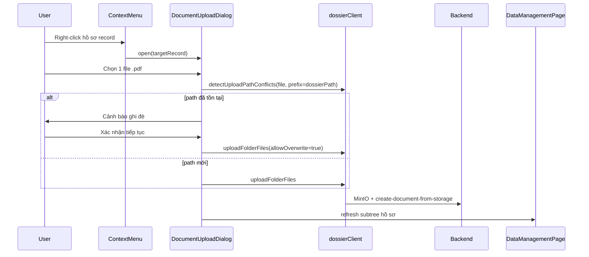

# Upload PDF trực tiếp vào hồ sơ trên cây dữ liệu

## Kết luận nhanh

| Câu hỏi | Trả lời |
|---------|---------|
| Có xử lý tương tự upload hồ sơ vào folder không? | **Có** — cùng pipeline `create-upload-point` → MinIO `FormData` → `create-document-from-storage` trong [`dossierClient.ts`](src/features/data-management/api/dossierClient.ts) |
| Khác biệt chính | Chọn **1 file PDF** (không `webkitdirectory`); `storagePathPrefix` = path của **hồ sơ** (không phải folder cha) |
| Tiêu chí nghiệp vụ | Hồ sơ → chỉ folder (`uploadDossier`, đã có); PDF → chỉ hồ sơ (`uploadDocument`, mới) |



---

## Cây file bị ảnh hưởng

```
src/features/data-management/
├── api/
│   └── dataManagementClient.ts              (modified) — validateDocumentUploadFile, resolveRecordStoragePrefix
├── components/
│   ├── DocumentUploadDialog.tsx             (new) — dialog chọn 1 PDF, progress, cảnh báo ghi đè
│   ├── DataNodeContextMenu.tsx              (modified) — thay addDocument → uploadDocument
│   ├── DataManagementPage.tsx               (modified) — wire dialog + refresh hồ sơ sau upload
│   └── DataNodeActionDialogs.tsx          (modified) — xóa mode addDocument mock
├── lib/
│   └── uploadPathPrefix.ts                  (modified) — resolveRecordStoragePrefix helper
├── queries.ts                               (modified) — có thể tái dùng useUploadDataFolderMutation
└── config/roleConfig.ts                     (không đổi — dùng canUpload như upload hồ sơ)

src/lib/i18n/locales/
├── en/data-management.json                  (modified)
└── vi/data-management.json                  (modified)
```

---

## Bước 1 — Helper resolve path hồ sơ

Trong [`uploadPathPrefix.ts`](src/features/data-management/lib/uploadPathPrefix.ts) thêm:

```typescript
export function resolveRecordStoragePrefix(record: DataTreeNodeT): string | undefined
```

Thứ tự ưu tiên:
1. `record.folderPath` → `folderPathToStoragePrefix()` (vd. `raw/abc/218_CD` → `abc/218_CD`)
2. Fallback: lấy parent path từ `filePath` của document con đầu tiên (vd. `raw/abc/218_CD/doc.pdf` → `abc/218_CD`)
3. `undefined` → block upload + toast `upload.errors.missingFolderPath`

Hồ sơ sau khi expand từ API thường vẫn giữ `folderPath` từ [`mapFolderChild`](src/features/data-management/api/dataManagementClient.ts); fallback giúp trường hợp cache cũ.

---

## Bước 2 — Validation riêng cho 1 file PDF

Trong [`dataManagementClient.ts`](src/features/data-management/api/dataManagementClient.ts):

```typescript
export function validateDocumentUploadFile(file: File): void
```

Ràng buộc:
- Đúng **1 file**
- Extension **`.pdf`** (tái dùng `hasInvalidUploadFiles` từ [`uploadParser.ts`](src/features/data-management/lib/uploadParser.ts))
- Không vượt `DATA_UPLOAD_MAX_FILE_SIZE_BYTES`
- **Không** chạy `validateNoMixedRecordFolder` (chỉ áp dụng upload folder)

`uploadDataFolder` / `uploadFolderFiles` **giữ nguyên** — đã hỗ trợ mảng 1 phần tử.

---

## Bước 3 — `DocumentUploadDialog` (component mới)

Dialog nhỏ, pattern tương tự [`FolderUploadDialog.tsx`](src/features/data-management/components/FolderUploadDialog.tsx) nhưng đơn giản hơn:

| Khía cạnh | Folder upload | Document upload |
|-----------|---------------|-----------------|
| Input | `webkitdirectory multiple` | `type="file" accept=".pdf,application/pdf"` |
| Target | `targetFolder` | `targetRecord: DataTreeNodeT` |
| Prefix | `folderPathToStoragePrefix(targetFolder.folderPath)` | `resolveRecordStoragePrefix(targetRecord)` |
| Validation | `validateFolderUploadFiles` | `validateDocumentUploadFile` |
| Conflict | Xóa hồ sơ trùng (`UploadConflictDialog`) | **Cảnh báo ghi đè** — không xóa hồ sơ |

**Luồng conflict (theo yêu cầu của bạn):**
1. `detectUploadPathConflicts` phát hiện path tồn tại
2. Hiện dialog cảnh báo: *"File đã tồn tại tại đường dẫn này. Tiếp tục sẽ ghi đè (backend xử lý)."*
3. User xác nhận → `runUpload({ allowOverwrite: true })` (bỏ qua `checkFilePath`, upload thẳng MinIO)
4. User hủy → quay `idle`, không upload

**Không** tái dùng [`UploadConflictDialog`](src/features/data-management/components/UploadConflictDialog.tsx) vì dialog đó xóa dossier vĩnh viễn — không phù hợp khi thêm/ghi đè 1 file trong hồ sơ đã có.

Props:
```typescript
{
  open, onOpenChange,
  role, projectCode,
  targetRecord?: DataTreeNodeT | null,
  onUploadSuccess?: (result: UploadFolderResult) => void
}
```

UI: hiển thị `upload.toRecord` với tên hồ sơ; progress bar khi uploading; disable khi thiếu `folderPath`.

---

## Bước 4 — Context menu & page wiring

### [`DataNodeContextMenu.tsx`](src/features/data-management/components/DataNodeContextMenu.tsx)

- Đổi item `addDocument` → `uploadDocument` (icon `Upload`, label i18n mới)
- Callback: `onUploadDocument?: (node: DataTreeNodeT) => void`
- Chỉ hiện khi:
  - `permissions.canUpload` (admin — giống `uploadDossier`)
  - `node.type === 'record'`
- **Không** hiện trên `folder` / `document` / root

Đảm bảo tiêu chí:
- Folder: chỉ `uploadDossier` (đã có, không đổi)
- Record: chỉ `uploadDocument` (mới)
- Document: không có upload

### [`DataManagementPage.tsx`](src/features/data-management/components/DataManagementPage.tsx)

- State: `uploadTargetRecord: DataTreeNodeT | null`
- Context menu: `onUploadDocument` → `setUploadTargetRecord(node); setDocumentUploadOpen(true)`
- Render `<DocumentUploadDialog targetRecord={uploadTargetRecord} ... />`
- `handleDocumentUploadSuccess`: `loadNodeTree(uploadTargetRecord.id, { refresh: true })` + OCR watch (tái dùng logic từ `handleUploadSuccess`)

---

## Bước 5 — Gỡ mock `addDocument`

- Xóa mode `addDocument` khỏi [`DataNodeActionDialogs.tsx`](src/features/data-management/components/DataNodeActionDialogs.tsx)
- Xóa `useAddDataDocumentMutation` / `addDataDocument` khỏi luồng UI (có thể giữ function trong client nếu chưa dùng nơi khác, hoặc xóa hẳn nếu dead code)
- Cập nhật i18n: xóa `actionDialog.addDocument.*` mock; thêm keys mới

---

## Bước 6 — i18n

Thêm vào [`en/data-management.json`](src/lib/i18n/locales/en/data-management.json) và [`vi/data-management.json`](src/lib/i18n/locales/vi/data-management.json):

- `contextMenu.uploadDocument` — "Upload document" / "Tải lên tài liệu"
- `upload.toRecord` — "Upload into dossier: {{name}}" / "Tải lên vào hồ sơ: {{name}}"
- `upload.pickFile` — "Choose PDF file" / "Chọn file PDF"
- `upload.overwriteWarning.title` — tiêu đề cảnh báo ghi đè
- `upload.overwriteWarning.description` — mô tả (file trùng path, backend ghi đè)
- `upload.overwriteWarning.continue` — nút xác nhận tiếp tục

---

## Rủi ro & mitigation

| Rủi ro | Mitigation |
|--------|------------|
| Hồ sơ thiếu `folderPath` | `resolveRecordStoragePrefix` fallback từ `filePath` con; block + toast nếu vẫn thiếu |
| Conflict dialog folder upload xóa nhầm hồ sơ | Dialog document upload dùng cảnh báo riêng, **không** gọi `deleteDataNode` |
| Backend không ghi đè như mong đợi | QA manual: upload file trùng tên, xác nhận file mới xuất hiện sau refresh |
| Editor không có `canUpload` | Đúng tiêu chí — chỉ admin upload; mock cũ chỉ admin thấy trên context menu |

---

## Checklist QA thủ công

1. Right-click **folder** → thấy "Tải lên hồ sơ", **không** thấy "Tải lên tài liệu"
2. Right-click **hồ sơ (record)** → thấy "Tải lên tài liệu", **không** thấy "Tải lên hồ sơ"
3. Right-click **document** → không có upload
4. Chọn file không phải PDF → validation error
5. Upload `doc.pdf` vào hồ sơ `218_CD` → file xuất hiện dưới hồ sơ; network tab key ≈ `/raw/{parent}/{218_CD}/doc.pdf`
6. Upload lại cùng tên → cảnh báo ghi đè → xác nhận → backend xử lý, tree refresh
7. Hủy cảnh báo ghi đè → không upload, dialog về idle

---

## Effort ước lượng

| Hạng mục | Thời gian |
|----------|-----------|
| Helper + validation | ~1h |
| DocumentUploadDialog | ~2–3h |
| Context menu + page wire + gỡ mock | ~1–2h |
| i18n + QA | ~1h |

**Tổng: ~0.5–1 ngày frontend**, không cần thay đổi backend nếu `create-document-from-storage` đã hỗ trợ ghi đè theo path.
