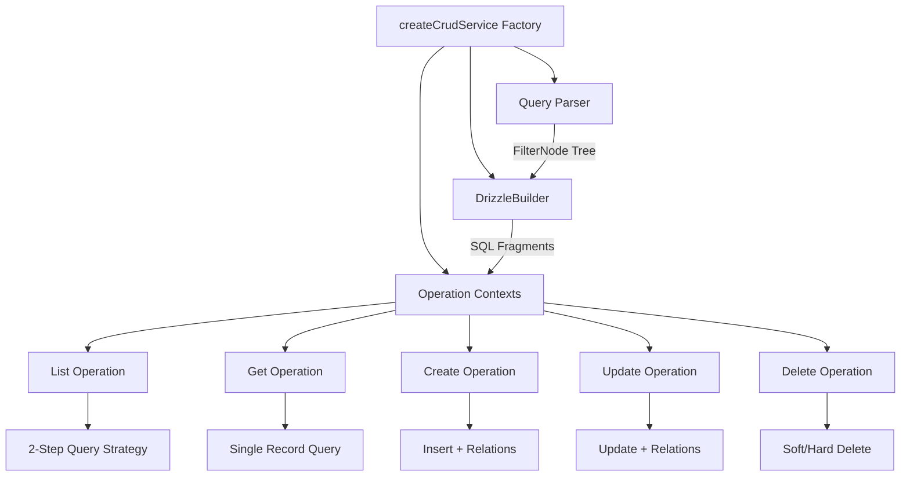
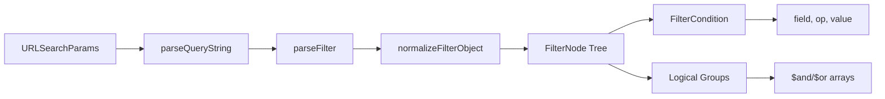
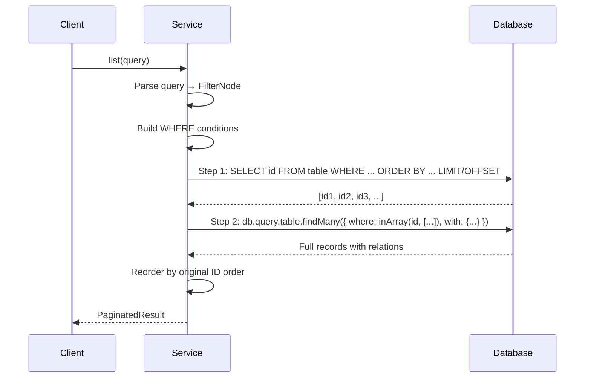
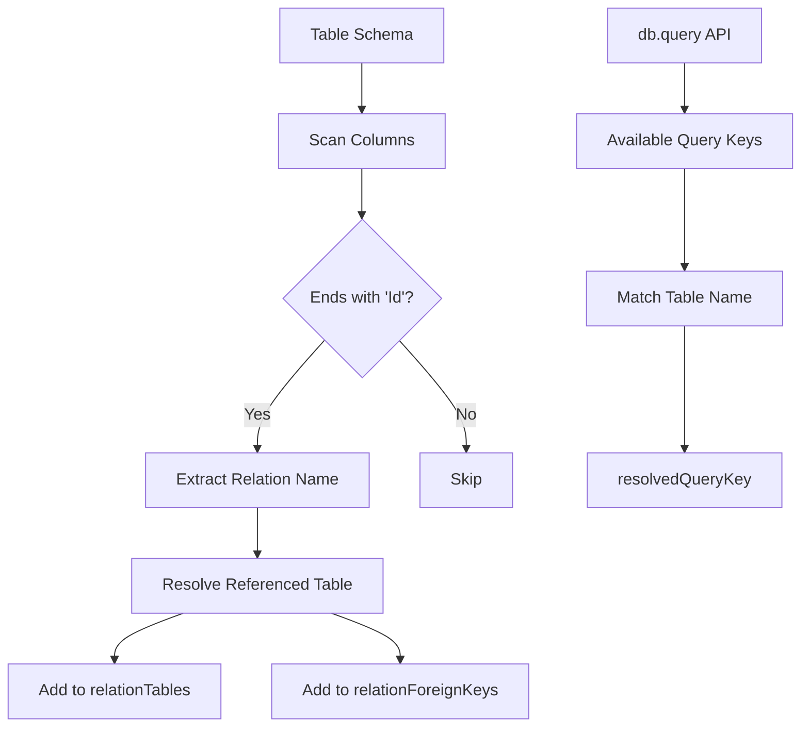
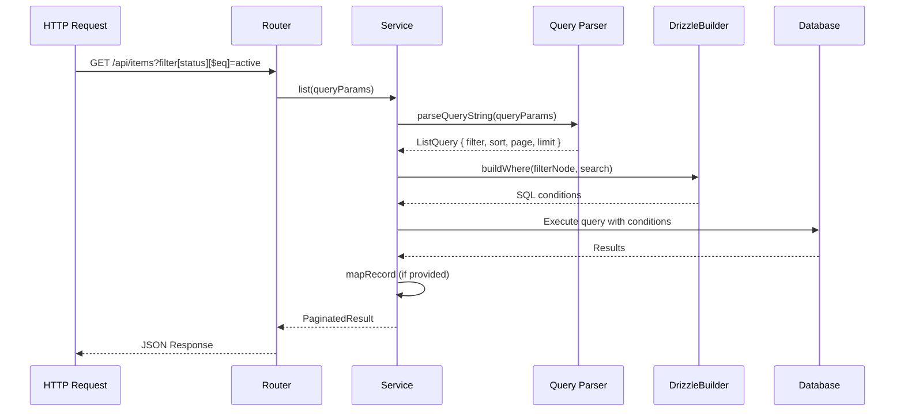

# Base CRUD Architecture Documentation

## Introduction

This document provides a comprehensive guide to the `@shared/base-crud` library architecture, implementation details, and patterns. It is designed to help developers understand how the system works and how to port it to other platforms like .NET.

**Purpose**: The base-crud library eliminates boilerplate code by providing a generic, type-safe CRUD service generator that handles:
- Pagination with configurable limits
- Full-text search across multiple fields
- Complex filtering with logical operators
- Multi-field sorting
- Automatic relation loading
- Soft delete support
- Schema validation and OpenAPI documentation

**Scope**: This document covers the internal architecture, data flow, query processing pipeline, cursor rules integration, and provides guidance for porting to .NET.

---

## Architecture Overview

### Design Pattern

The library follows a **Factory Pattern** combined with a **Service-Operation** architecture:



### Core Components

1. **`createCrudService` (baseService.ts)**: Main factory function that orchestrates all operations
   - Creates operation contexts with shared configuration
   - Infers relations from schema
   - Returns service object with CRUD methods

2. **`parseQueryString` (query.ts)**: Robust query parser
   - Converts URLSearchParams/objects → FilterNode tree
   - Supports bracket notation for complex queries
   - Handles logical operators ($and, $or)
   - Detects relation paths (dot notation)

3. **`DrizzleBuilder` (drizzle-builder.ts)**: SQL fragment generator
   - Converts FilterNode → Drizzle SQL conditions
   - Builds WHERE clauses with operators
   - Constructs ORDER BY from sort items
   - Handles relation joins for filtering/sorting

4. **Operations (src/operations/)**: Modular CRUD operations
   - `list.ts`: Paginated listing with relations
   - `get.ts`: Single record retrieval
   - `create.ts`: Record creation with relation loading
   - `update.ts`: Record update with relation loading
   - `delete.ts`: Soft/hard delete support

### Type System

The library uses TypeScript generics extensively for type safety:

```typescript
createCrudService<
    TEntitySchema extends TSchema | undefined,
    TCreateSchema extends TSchema | undefined,
    TUpdateSchema extends TSchema | undefined,
    TableType = any,
    ID extends string | number = string | number
>(opts: DrizzleServiceOptions<...>)
```

**Key Type Utilities**:
- `InferStatic<T>`: Extracts static type from Elysia schema
- `PaginatedResult<T>`: Standardized pagination response
- `FilterNode`: Tree structure for complex filters
- `DatabaseQuery<ID>`: Relational query API interface

---

## How It Works (Cách Làm)

### 1. Query Parsing Pipeline

The query parser transforms HTTP query parameters into a structured `FilterNode` tree:

**Input**: `?filter[status][$eq]=active&filter[priority][$gte]=5&sort=createdAt:desc&page=1&limit=50`

**Process**:


**Output Structure**:
```typescript
{
  filter: {
    $and: [
      { field: "status", op: "$eq", value: "active" },
      { field: "priority", op: "$gte", value: 5 }
    ]
  },
  sort: [{ field: "createdAt", direction: "desc" }],
  page: 1,
  limit: 50
}
```

**Supported Operators**:
- `$eq`: Equal to
- `$in`: In array
- `$nin`: Not in array
- `$gte`: Greater than or equal
- `$lte`: Less than or equal
- `$gt`: Greater than
- `$lt`: Less than

**Relation Support**: Dot notation automatically detected:
- `filter[student.name][$eq]=John` → `{ field: "student.name", relation: "student", relationField: "name" }`
- `sort=student.createdAt:desc` → `{ field: "student.createdAt", relation: "student", relationField: "createdAt" }`

### 2. Two-Step Query Strategy (List Operation)

The list operation uses a unique two-step approach to handle pagination correctly with 1:N relations:

**Problem**: Standard SQL pagination breaks when joining 1:N relations because each related record creates a new row, causing:
- Incorrect total counts
- Duplicate main records
- Wrong page boundaries

**Solution**: Two-step query strategy



**Step 1: Fetch IDs**
```typescript
// Only select IDs with all filters/sorts applied
const idRows = await db
  .select({ id: table.id })
  .from(table)
  .leftJoin(relationTable, joinCondition)
  .where(whereConditions)
  .orderBy(...orderBy)
  .limit(limit)
  .offset(offset);
```

**Step 2: Hydrate Records**
```typescript
// Fetch full records with relations using relational API
const records = await db.query.table.findMany({
  where: (row, { inArray }) => inArray(row.id, ids),
  with: sanitizedWith
});
```

**Benefits**:
- Accurate pagination regardless of relation cardinality
- Efficient relation loading via Drizzle's relational API
- Maintains sort order from Step 1
- Prevents row multiplication issues

### 3. Relation Inference and Auto-Discovery

The system attempts to automatically discover relations to minimize configuration:

**Inference Process**:


**Example**:
```typescript
// Table has column: schoolId
// Auto-detected:
relationTables: {
  school: schoolsTable
}
relationForeignKeys: {
  school: schoolIdColumn
}
```

**Manual Override**: For complex cases, relations can be explicitly configured:
```typescript
createCrudService({
  relationTables: {
    student: studentsTable,
    classroom: classroomsTable
  },
  relationForeignKeys: {
    student: enrollment.studentId,
    classroom: enrollment.classroomId
  }
});
```

### 4. Schema Generation for Elysia/OpenAPI

The library automatically generates Elysia schemas for request/response validation and Swagger documentation:

**Generated Schemas**:
- `getListResponseSchema()`: Paginated response structure
- `getRecordResponseSchema()`: Single record response
- `createApiDocs()`: Complete OpenAPI configuration

**Integration**:
```typescript
const service = createCrudService({...});

// Use in Elysia router
app.get("/", {
  query: service.getListResponseSchema(),
  response: service.getListResponseSchema(),
  detail: service.getDocs().list.detail
}, async ({ query }) => {
  return await service.list(query);
});
```

---

## How It Operates (Hoạt Động)

### Request Flow



### Operation Execution Flow

#### List Operation
1. Parse query string → `ListQuery`
2. Build WHERE conditions from filter/search
3. Build ORDER BY from sort
4. Apply soft delete filter (if `deletedAt` exists)
5. Apply `restrictServiceQuery` (multi-tenancy)
6. Apply `internalFilterQuery` (per-call filters)
7. Execute Step 1: Fetch IDs
8. Execute Step 2: Hydrate with relations
9. Apply `mapRecord` transformation
10. Return `PaginatedResult`

#### Get Operation
1. Validate ID
2. Build WHERE conditions (id + filters)
3. Execute query
4. Load relations if `resolvedQueryKey` exists
5. Apply `mapRecord` transformation
6. Return entity

#### Create Operation
1. Insert record via Drizzle
2. If `resolvedQueryKey` exists, reload with relations
3. Apply `mapRecord` transformation
4. Return created entity

#### Update Operation
1. Validate ID
2. Build WHERE conditions (id + optional filters)
3. Update record (auto-set `updatedAt`)
4. If `resolvedQueryKey` exists, reload with relations
5. Apply `mapRecord` transformation
6. Return updated entity

#### Delete Operation
1. Validate ID
2. Build WHERE conditions (id + filters)
3. Check if `deletedAt` column exists:
   - **Soft delete**: UPDATE SET deletedAt = NOW()
   - **Hard delete**: DELETE FROM table
4. Return deleted ID

### Error Handling

Errors are handled globally with HTTP status codes:
- `400 Bad Request`: Invalid ID, malformed query
- `404 Not Found`: Record not found
- `500 Internal Server Error`: Database/validation errors

**Validation Flow**:
```typescript
try {
  validateId(id);
} catch (error) {
  throw httpError.badRequest(error.message);
}
```

### Soft Delete Mechanism

Automatic soft delete support when `deletedAt` column exists:

**Detection**:
```typescript
if ((table as any).deletedAt) {
  conditions.push(isNull((table as any).deletedAt));
}
```

**Delete Behavior**:
- **Soft delete**: Sets `deletedAt = NOW()`, `updatedAt = NOW()`
- **Hard delete**: Removes record from database
- **Read operations**: Automatically filter out soft-deleted records

---

## Cursor Rules System

The codebase uses Cursor rules to enforce consistent patterns and architecture. The base-crud library integrates with these rules in several ways:

### Relevant Rules

#### 1. `backend-style.mdc`

**Key Patterns Enforced**:
- Services extend `createCrudService` from `@shared/base-crud`
- Spread `...crud` then add custom methods as plain object functions (no classes)
- Use `internalFilter` / `internalFilterQuery` for multi-tenant scoping

**Example from Rule**:
```typescript
// ✅ Correct pattern
const crud = createCrudService({...});
export const SchoolService = {
  ...crud,
  async customMethod() { /* ... */ }
};

// ❌ Wrong: Using classes
export class SchoolService {
  // ...
}
```

**Real Example from Codebase** (`modules/todo/todo-service.ts`):
```typescript
const crud = createCrudService({
    db,
    table: todos,
    searchable: ["name", "description"],
    createSchema: createTodoSchema,
    updateSchema: updateTodoSchema,
    entitySchema: todoEntitySchema,
    metadata: { tags: ["Todo"], descriptions: {...} }
});

export const TodoService = {
    ...crud,
};
```

#### 2. `code-files.mdc`

**Key Patterns Enforced**:
- Lean, self-documenting code
- No redundant comments
- Import organization: standard → third-party → shared → local
- Prefer reusing libraries from `./shared`

**Applied in base-crud**:
- Minimal comments (only for WHY, not WHAT)
- Clear function names: `executeListOperation`, `buildWhere`, `parseQueryString`
- Reusable utilities in `utils.ts`

### Patterns Enforced by Rules

#### Pattern 1: Spread `...crud` Pattern

**Why**: Ensures all base CRUD methods are available while allowing extension

**Implementation**:
```typescript
// baseService.ts returns object with methods
return {
  list,
  get,
  create,
  update,
  delete: delete_,
  getCreateSchema,
  getUpdateSchema,
  // ...
};

// Services spread it
export const MyService = {
  ...crud,  // All CRUD methods
  customMethod() { }  // Custom logic
};
```

#### Pattern 2: Factory Functions for Routers

**Why**: Consistent router creation with shared plugins

**Rule Reference**: `backend-style.mdc` - "use factory functions that return configured `Elysia` instances"

**Example Pattern** (not in base-crud, but used by consumers):
```typescript
export function createSchoolRouter(service: SchoolService) {
  return new Elysia({ name: "school-router", prefix: "/schools" })
    .use(plugins.authSchoolScoped)
    .use(plugins.urlQuery)
    .get("/", async ({ query }) => {
      return await service.list(query);
    });
}
```

#### Pattern 3: `internalFilter` for Multi-Tenancy

**Why**: Enforce data isolation at service level

**Rule Reference**: `backend-style.mdc` - "Use `internalFilter` / `internalFilterQuery` in services and routers to enforce multi-tenant scoping"

**Usage Example**:
```typescript
const crud = createCrudService({
  db,
  table: classrooms,
  restrictServiceQuery: () => eq(classrooms.schoolId, currentSchoolId)
});

// All queries automatically filtered by schoolId
await crud.list({}); // Only returns classrooms for current school
```

**Implementation in base-crud**:
```typescript
// list.ts
if (restrictServiceQuery) {
  extraFilters.push(restrictServiceQuery());
}

// get.ts, update.ts, delete.ts
if (restrictServiceQuery) {
  conditions.push(restrictServiceQuery());
}
```

### How Rules Guide Development

1. **Service Creation**: Rules enforce using `createCrudService` factory
2. **Extension Pattern**: Rules enforce spreading `...crud` before adding custom methods
3. **Multi-Tenancy**: Rules enforce using `internalFilter` for data scoping
4. **Code Style**: Rules enforce lean, self-documenting code

**Result**: Consistent architecture across all modules using base-crud

---

## Porting to .NET

This section provides guidance for porting the base-crud library to .NET (C#).

### Technology Mapping

| TypeScript/Deno | .NET Equivalent | Notes |
|----------------|------------------|-------|
| `createCrudService` factory | Static factory method or generic base class | C# doesn't have function factories, use static methods or generics |
| Drizzle ORM | Entity Framework Core / Dapper | EF Core for relational queries, Dapper for performance |
| Elysia schemas (T.Alpine) | FluentValidation / Data Annotations | FluentValidation for complex rules |
| TypeScript generics | C# generics | Similar concept, different syntax |
| `Record<string, unknown>` | `Dictionary<string, object>` | C# dictionary type |
| `Promise<T>` | `Task<T>` | Async/await pattern similar |
| URLSearchParams | `IQueryCollection` / `NameValueCollection` | ASP.NET Core query parsing |

### Architecture Mapping

#### 1. Factory Pattern

**TypeScript**:
```typescript
export function createCrudService<TEntity, TCreate, TUpdate>(opts: Options) {
  return {
    list: async (query) => { /* ... */ },
    get: async (id) => { /* ... */ },
    // ...
  };
}
```

**C# Equivalent**:
```csharp
public static class CrudServiceFactory
{
    public static ICrudService<TEntity, TId> Create<TEntity, TId>(
        CrudServiceOptions<TEntity, TId> options)
        where TEntity : class
        where TId : struct
    {
        return new CrudService<TEntity, TId>(options);
    }
}

// Or using generic base class
public abstract class BaseCrudService<TEntity, TId> 
    where TEntity : class
    where TId : struct
{
    protected readonly DbContext _db;
    protected readonly DbSet<TEntity> _table;
    
    public BaseCrudService(DbContext db)
    {
        _db = db;
        _table = db.Set<TEntity>();
    }
    
    public virtual async Task<PaginatedResult<TEntity>> ListAsync(
        ListQuery query) { /* ... */ }
}
```

#### 2. Query Parsing

**TypeScript**:
```typescript
export function parseQueryString(input: URLSearchParams | string | Record<string, unknown>): ListQuery {
  // Parse bracket notation: filter[status][$eq]=active
  // Return FilterNode tree
}
```

**C# Equivalent**:
```csharp
public class QueryParser
{
    public static ListQuery Parse(IQueryCollection query)
    {
        var result = new ListQuery();
        
        // Parse filter bracket notation
        var filterEntries = query
            .Where(kvp => kvp.Key.StartsWith("filter["))
            .ToList();
        
        result.Filter = ParseFilter(filterEntries);
        result.Sort = ParseSort(query["sort"]);
        result.Page = int.Parse(query["page"].FirstOrDefault() ?? "1");
        result.Limit = int.Parse(query["limit"].FirstOrDefault() ?? "50");
        
        return result;
    }
    
    private static FilterNode ParseFilter(List<KeyValuePair<string, StringValues>> entries)
    {
        // Build FilterNode tree from bracket notation
        // Similar logic to TypeScript version
    }
}
```

#### 3. Two-Step Query Strategy

**TypeScript**:
```typescript
// Step 1: Fetch IDs
const idRows = await db.select({ id: table.id })
  .from(table)
  .where(where)
  .limit(limit)
  .offset(offset);

// Step 2: Hydrate with relations
const records = await db.query.table.findMany({
  where: (row, { inArray }) => inArray(row.id, ids),
  with: sanitizedWith
});
```

**C# Equivalent (Entity Framework Core)**:
```csharp
// Step 1: Fetch IDs
var ids = await _table
    .Where(whereCondition)
    .OrderBy(sortExpression)
    .Skip((page - 1) * limit)
    .Take(limit)
    .Select(e => e.Id)
    .ToListAsync();

// Step 2: Hydrate with relations
var records = await _table
    .Where(e => ids.Contains(e.Id))
    .Include(e => e.Relation1)
    .Include(e => e.Relation2)
    .ToListAsync();

// Reorder by original ID order
var ordered = ids
    .Select(id => records.First(r => r.Id == id))
    .ToList();
```

#### 4. Filter Building

**TypeScript**:
```typescript
export const DrizzleBuilder = {
  buildWhere(ctx: QueryContext, filter?: FilterNode): SQL[] {
    // Convert FilterNode to Drizzle SQL conditions
    if (filter.$and) {
      return filter.$and.map(n => this.applyFilter(ctx, n));
    }
    // ...
  }
};
```

**C# Equivalent**:
```csharp
public class FilterBuilder
{
    public Expression<Func<TEntity, bool>> BuildWhere(
        FilterNode filter, 
        QueryContext context)
    {
        if (filter.And != null)
        {
            var conditions = filter.And
                .Select(n => BuildCondition(n, context))
                .ToList();
            
            return conditions.Aggregate(
                (expr1, expr2) => CombineAnd(expr1, expr2));
        }
        // ...
    }
    
    private Expression<Func<TEntity, bool>> BuildCondition(
        FilterCondition condition, 
        QueryContext context)
    {
        var param = Expression.Parameter(typeof(TEntity), "e");
        var property = Expression.Property(param, condition.Field);
        
        return condition.Op switch
        {
            "$eq" => Expression.Equal(property, Expression.Constant(condition.Value)),
            "$in" => BuildInArray(property, condition.Value),
            "$gte" => Expression.GreaterThanOrEqual(property, Expression.Constant(condition.Value)),
            // ...
        };
    }
}
```

#### 5. Service Implementation

**TypeScript**:
```typescript
const crud = createCrudService({
  db,
  table: todos,
  searchable: ["name", "description"],
  createSchema: createTodoSchema,
  updateSchema: updateTodoSchema,
  entitySchema: todoEntitySchema
});

export const TodoService = {
  ...crud,
};
```

**C# Equivalent**:
```csharp
public class TodoService : BaseCrudService<Todo, Guid>
{
    public TodoService(ApplicationDbContext db) : base(db)
    {
        SearchableFields = new[] { "Name", "Description" };
    }
    
    protected override Expression<Func<Todo, bool>> BuildSearchExpression(string search)
    {
        return t => t.Name.Contains(search) || t.Description.Contains(search);
    }
}

// Or using factory pattern
public static class TodoServiceFactory
{
    public static ICrudService<Todo, Guid> Create(ApplicationDbContext db)
    {
        var options = new CrudServiceOptions<Todo, Guid>
        {
            Db = db,
            Table = db.Todos,
            SearchableFields = new[] { "Name", "Description" }
        };
        
        return CrudServiceFactory.Create(options);
    }
}
```

### Key Differences and Considerations

1. **Type System**:
   - TypeScript: Structural typing, type inference
   - C#: Nominal typing, explicit generics constraints

2. **Async/Await**:
   - TypeScript: `Promise<T>`, `async/await`
   - C#: `Task<T>`, `async/await` (similar but different runtime)

3. **ORM Differences**:
   - Drizzle: Query builder with relational API
   - EF Core: LINQ expressions, `Include()` for relations
   - Consider using Dapper for performance-critical queries

4. **Validation**:
   - Elysia: Runtime schema validation
   - C#: FluentValidation or Data Annotations with model binding

5. **Query Parsing**:
   - TypeScript: Flexible bracket notation parsing
   - C#: Use `IQueryCollection` or custom model binder

### Recommended .NET Architecture

```csharp
// Base interface
public interface ICrudService<TEntity, TId>
    where TEntity : class
    where TId : struct
{
    Task<PaginatedResult<TEntity>> ListAsync(ListQuery query);
    Task<TEntity> GetAsync(TId id);
    Task<TEntity> CreateAsync(TCreate input);
    Task<TEntity> UpdateAsync(TId id, TUpdate input);
    Task<TId> DeleteAsync(TId id);
}

// Generic implementation
public class CrudService<TEntity, TId> : ICrudService<TEntity, TId>
    where TEntity : class, IEntity<TId>
    where TId : struct
{
    // Implementation similar to TypeScript version
}

// Usage
public class TodoService : CrudService<Todo, Guid>
{
    public TodoService(ApplicationDbContext db) 
        : base(db, new CrudServiceOptions { SearchableFields = new[] { "Name" } })
    {
    }
}
```

### Testing Strategy

Port the test suite structure:
- Unit tests for query parsing
- Unit tests for filter building
- Integration tests for CRUD operations
- Tests for relation handling

---

## Summary

The `@shared/base-crud` library provides a powerful, type-safe CRUD service generator that:

1. **Eliminates Boilerplate**: Reduces service code by 80-90%
2. **Type Safety**: Full TypeScript generics for compile-time safety
3. **Flexible Querying**: Complex filtering, sorting, searching out of the box
4. **Relation Support**: Automatic relation loading and join handling
5. **Consistent Patterns**: Enforced by Cursor rules across codebase

**Key Innovations**:
- Two-step query strategy for accurate pagination with relations
- Automatic relation inference
- Flexible query parsing with bracket notation
- Soft delete support built-in

**Porting to .NET**:
- Use generic base classes or factory methods
- Entity Framework Core for ORM
- FluentValidation for schemas
- Similar architecture with C# idioms

This architecture provides a solid foundation for building scalable, maintainable CRUD services in any language.

