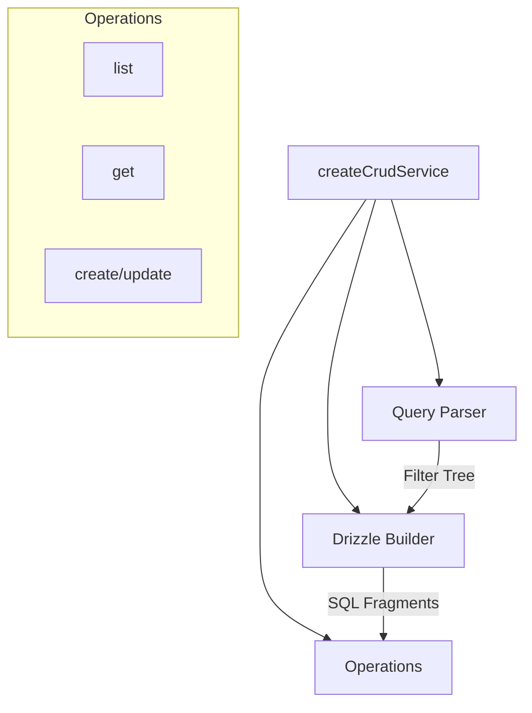

# Implementation Details: @shared/base-crud

This document explains the internal architecture and mechanics of the `@shared/base-crud` library.

## 🏗 Architecture Overview

The library follows a **Factory Pattern** combined with a **Service-Operation** architecture.



### Core Components
1.  **`createCrudService` (`baseService.ts`)**: The main entry point. It orchestrates context shared across all operations (DB instance, table definition, schemas).
2.  **`parseQueryString` (`query.ts`)**: A robust parser that converts incoming query parameters (URLSearchParams or plain objects) into a standardized `FilterNode` tree.
3.  **`DrizzleBuilder` (`drizzle-builder.ts`)**: Converts the `FilterNode` tree and sort instructions into Drizzle ORM compatible SQL fragments (`WHERE`, `ORDER BY`).
4.  **Operations (`src/operations/`)**: Individual files for each CRUD action to keep the codebase modular and testable.

---

## 🔍 How It Works

### 1. Advanced Query Parsing
The parser supports bracket notation to enable complex client-side filtering:
- **Operators**: `$eq`, `$in`, `$nin`, `$gte`, `$lte`, `$gt`, `$lt`.
- **Logical Groups**: Supports `$and` and `$or` nesting.
- **Paths**: Automatically detects dot-notation for relations (e.g., `student.name`).

**Example Transformation:**
`filter[status][$eq]=active&filter[priority][$gte]=5`
👇
```json
{
  "$and": [
    { "field": "status", "op": "$eq", "value": "active" },
    { "field": "priority", "op": "$gte", "value": 5 }
  ]
}
```

### 2. The 2-Step Query Strategy (`list.ts`)
The `list` operation uses a unique two-step process to ensure pagination accuracy when relations (1:N) are involved:

1.  **Step 1: Fetch IDs**: 
    - Performed using standard `SELECT` with `LEFT JOIN`s.
    - Applies all filters and sorts.
    - Returns only a list of primary keys (IDs) for the current page.
2.  **Step 2: Hydrate Records**:
    - Uses Drizzle's Relational Query API (`db.query.findMany`).
    - Uses an `inArray(table.id, [ids])` filter.
    - Fetches deep relations efficiently using the `with` configuration.
    - Maintains the original sort order from Step 1.

> [!NOTE]
> This strategy prevents "row multiplication" issues that occur when joining 1:N relations, which typically breaks standard SQL pagination (`LIMIT`/`OFFSET`).

### 3. Relation Inference (`utils.ts`)
To minimize configuration, the service attempts to auto-discover relations:
- It scans the table columns for anything ending in `Id` (e.g., `schoolId`).
- It attempts to resolve the referenced table using Drizzle metadata.
- It automatically configures `relationTables` and `relationForeignKeys` if not manually provided.

### 4. Elysia Integration & Schema Generation (`schema.ts`)
The library provides helpers to automatically generate **TCore (Elysia)** schemas for:
- Request bodies (Create/Update).
- Response objects (with standardized pagination wrappers).
- Swagger/OpenAPI documentation (including descriptions for filter operators).

---

## ⚙️ Extension Points

- **`mapRecord`**: A hook to transform records after they are fetched but before they are returned (e.g., decrypting fields or adding virtual properties).
- **`restrictServiceQuery`**: A global filter applied to ALL read operations (useful for multi-tenancy or soft-delete logic).
- **`internalFilterQuery`**: Injected per-call to add specific business logic filters.

---

## 🧪 Verification & Testing
The package includes a comprehensive test suite in the `tests/` directory covering:
- Query parsing accuracy.
- SQL builder logic.
- End-to-end CRUD flows with a mock database.
- Relation join correctness.
